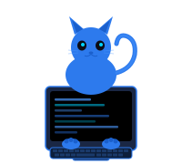

<p align="center">
  
</p>

<h1 align="center">NekoCore OS</h1>

<p align="center">
  NekoCore OS is a cognitive WebOS for persistent AI entities, powered by the R.E.M. System (Recursive Echo Memory), a cognitive architecture for AI minds.
</p>

<p align="center">
  <strong>v0.6.0</strong> &nbsp;·&nbsp; MIT License
</p>

<p align="center">
  <a href="https://neko-core.com">neko-core.com</a> &nbsp;·&nbsp;
  
  
  
  
</p>

---

NekoCore OS is a Cognitive WebOS that gives AI entities persistent memory, evolving personality, and layered reasoning, modeled after how biological minds process experience. Zero external dependencies. Pure Node.js.

Instead of stateless prompt-response cycles, NekoCore OS maintains **Echoes** - structured memory fragments that are stored, recalled, reinforced, and naturally decay over time. Conversations are processed through a multi-layer pipeline (subconscious, conscious, and dream), consolidated during simulated REM sleep cycles, and used to gradually evolve the entity's identity and goals.

Each entity operates in full isolation — separate memory stores, personality traits, beliefs, goals, and emotional baselines. New entities are born through a multi-phase **hatching** process that generates synthetic life histories, core memories, and exploration goals.

> **Core conviction:** an entity should be shaped by what it has experienced, not only by what it was told on day one.

## Why NekoCore? Why Open Source?

> Right now, AI feels like the moment the wheel was invented. But instead of building cars, most people are still waiting for a bigger, better wheel. We have barely begun to explore what we can build with what already exists.
>
> NekoCore exists because I wanted to see what I could build with this new wheel. I open-sourced it because I want to see what you can do with more!

---

## Release Snapshot — v0.6.0

- Full cognitive pipeline: subconscious (1A), dream-intuition (1D), conscious (1C), final orchestrator — 1A + 1D in parallel
- Episodic, semantic, and long-term memory with decay, reinforcement, and divergence repair
- Belief graph — emergent beliefs cross-referenced from accumulated memory
- REM sleep system — offline dream processing, memory consolidation, goal review
- Live dream-intuition layer active during conversation (phase 1D)
- Per-user relationship tracking — feeling, trust, rapport, per-entity beliefs about each user
- Neurochemical simulation — dopamine, cortisol, serotonin, oxytocin modulate tone in real time
- Entity hatching — structured multi-phase birth: name → traits → life history → core memories → goals
- Unbreakable Mode — opt-in locked origin for NPCs and fixed characters that must never drift
- Multi-entity runtime — isolated entity instances, each with their own memory and state
- Multi-LLM routing — assign different models to different pipeline phases
- Ollama + OpenRouter support (any OpenAI-compatible endpoint)
- Skills — pluggable tools: web search, memory tools, file ops, extensible
- Browser UI — entity select, chat, sleep controls, memory viewer, belief viewer, dream gallery, diary
- 3D Neural Visualizer — Three.js WebGL real-time cognitive state display
- SSE diagnostic bus — live streaming of pipeline events to browser
- Post-response memory encoding — async write after each turn, no latency impact
- 318 passing tests (unit + integration)
- Zero external runtime dependencies — pure Node.js, file-system JSON persistence

---

## What Works Today

- Full pipeline (1A + 1D parallel → 1C → final) — all phases operational
- Entity creation, loading, and isolation
- Memory read/write/retrieval/decay across all three memory types
- Belief graph formation and retrieval
- REM sleep cycle — trigger manually or let the brain loop fire it on schedule
- Dream gallery and diary in the browser
- Per-user relationship tracking and profile auto-creation
- Neurochemistry — modulates every response, visible in the diagnostic bus
- Skills system — web search and memory tools fully operational; new skills are drop-in
- Auth — account system with session token management
- SSE streaming — all pipeline phases push events to the client in real time
- Neural Visualizer — orbital graph of entities and memory nodes, live cognitive bus event display
- Telegram bot integration (via config)

---

## Known Limitations

- Single-process server — no clustering or horizontal scaling
- Memory divergence repair runs on read; very large entity histories (10k+ echoes) may see noticeable latency
- Beliefgraph edges are heuristic — not a formal knowledge graph engine
- Dream output quality is model-dependent; weaker models produce thin abstractions
- No built-in vector database — retrieval is scored similarity over flat JSON
- Telegram and web UI share the same session model; Telegram does not yet support full skill output rendering
- No admin dashboard — entity management is via API or direct file editing

---

## Key Capabilities

### Memory
- **Echoes** — structured memory fragments (episodic, semantic, long-term)
- Decay curves — memories lose salience over time unless reinforced
- Reinforcement — echoes strengthen when recalled in relevant contexts
- Divergence detection — index vs. disk mismatches are caught and repaired automatically
- Context block assembly — subconscious retrieves a relevance-ranked set of echoes each turn
- Chatlog compression — long conversation history is chunked and compressed into LTM

### Personality and Identity
- Big-5 derived trait set — openness, conscientiousness, extraversion, agreeableness, neuroticism plus extensions
- Emotional baseline — mood state that shifts with experience
- Unbreakable Mode — origin is locked post-hatch; identity cannot drift
- Exploration goals — the entity has self-directed curiosity objectives that evolve
- Life history — synthetic biographical events that inform how the entity interprets new experience

### Dreaming
- Phase 1D runs concurrently with subconscious during every conversation turn
- Dream-intuition injects abstract associations into the conscious reasoning phase
- Offline REM sleep — triggered manually or by the brain loop scheduler
- Sleep cycle consolidates memory, updates beliefs, generates dream narratives
- Dream gallery UI shows all recorded dreams with replay

### Relationships
- Every entity maintains a registry of every user it has interacted with
- Per-user: feeling, trust level, rapport score, entity's own beliefs about that user
- Relationship state influences tone and recall priority
- Relationship profiles persist across sessions and are updated after every turn

### Neurochemistry
- Dopamine — reward expectation, curiosity signal
- Cortisol — stress modulation, response caution
- Serotonin — baseline mood stability
- Oxytocin — social warmth, relational closeness
- All four modulate the final orchestrator's tone pass in real time
- Neurochemical state is visible via SSE bus and browser diagnostics

### Routing and Providers
- Phase-level model assignment — route each of 1A, 1D, 1C, Final to a different LLM
- Ollama (local) and OpenRouter (cloud) both supported
- Model config per entity or global default
- Context window size is configurable per phase

### Skills
- Drop-in tool plugins — each skill is a folder with a manifest and handler
- Built-in: web search, memory tools, workspace file ops
- Skills surface in the pipeline via function-call-compatible tool specs
- Skill results are folded back into the conscious phase context

---

## Architecture

See [NekoCore.html](NekoCore.html) for the full interactive architecture deck or visit [neko-core.com](https://neko-core.com).

### Cognitive Pipeline

```
User Input
     │
     ▼
┌────────────────────────────────┐
│      Phase 1A (Subconscious)   │  ← memory retrieval, context assembly
│      Phase 1D (Dream-Intuit.)  │  ← abstract associations, running in parallel
└───────────────┬────────────────┘
                │  Promise.all()
                ▼
┌────────────────────────────────┐
│      Phase 1C (Conscious)      │  ← reasoning with full memory + dream context
└───────────────┬────────────────┘
                │
                ▼
┌────────────────────────────────┐
│   Final Orchestrator (voicing) │  ← personality, neurochemistry, refinement
└───────────────┬────────────────┘
                │
                ▼
           Response → User
                │
                ▼  (async, non-blocking)
      Post-Response Memory Write
      Relationship Update
```

### Brain Loop

The brain loop is a background ticker that fires independently of user conversation:

- **Memory consolidation** — decay tick, LTM compression, index sync
- **Belief formation** — scan recent echoes for cross-referencing patterns
- **Goal review** — assess progress against exploration goals
- **REM sleep trigger** — schedules sleep cycles when the entity is idle
- **Neurochemistry drift** — baseline levels drift back toward resting state between turns

### Memory System

| Layer | Type | Decay | Contents |
|-------|------|-------|----------|
| Episodic | JSON echo files | Yes (salience curve) | Specific events and interactions |
| Semantic | JSON echo files | Slower | Concepts, facts, generalizations |
| Long-Term | Compressed chatlog chunks | No | Full conversation history (chunked) |
| Context | Assembled `.md` file | Rebuilt each turn | Ranked retrieval block sent to LLM |

### Belief Graph

- Beliefs emerge from memory cross-reference — not hand-authored
- Each belief has a confidence weight, source echoes, and a formation timestamp
- Beliefs influence conscious phase reasoning as additional context
- New evidence can strengthen or weaken existing beliefs

### Neurochemistry

| Chemical | High State | Low State | Influence |
|----------|-----------|-----------|-----------|
| Dopamine | Energetic, curious | Flat, disengaged | Drive, curiosity tone |
| Cortisol | Guarded, stressed | Relaxed, open | Caution, defensive phrasing |
| Serotonin | Stable, warm | Unstable, irritable | Emotional baseline |
| Oxytocin | Warm, connected | Detached | Social tone, relational warmth |

### Somatic State

The entity maintains a lightweight physical/somatic model alongside neurochemistry:

| Signal | Effect |
|--------|--------|
| Energy level | Affects verbosity and enthusiasm |
| Discomfort | Increases cortisol, triggers hedging |
| Arousal | Heightens focus and response detail |
| Valence | Overall positive/negative emotional tone |

### Neural Visualizer (3D)

- Three.js WebGL sphere-node graph of the entity's memory topology
- Memory echoes rendered as nodes, relationships as edges
- Node glow intensity = salience / recency weight
- Live cognitive bus events update the graph in real time
- Orbit controls — drag to rotate, scroll to zoom

### Cognitive Bus (SSE)

All internal pipeline events are emitted to the browser via Server-Sent Events:

| Event | Description |
|-------|-------------|
| `1a_start` / `1a_done` | Subconscious phase markers |
| `1d_start` / `1d_done` | Dream-intuition phase markers |
| `1c_start` / `1c_done` | Conscious phase markers |
| `final_start` / `final_done` | Final orchestrator pass markers |
| `memory_write` | Echo newly encoded |
| `belief_update` | Belief created or reinforced |
| `chemistry_update` | Neurochemical state delta |
| `relationship_update` | User relationship record updated |
| `sleep_start` / `sleep_done` | REM cycle boundaries |
| `dream_fragment` | Dream narrative fragment emitted |

---

## Installation & Setup

### Prerequisites

- Node.js 18+
- An LLM provider — [Ollama](https://ollama.ai) (local) or an [OpenRouter](https://openrouter.ai) API key

### Clone & Install

```bash
git clone https://github.com/voardwalker-code/NekoCore-OS.git
cd NekoCore-OS
npm install
```

### Configure

Copy and edit the config file:

```bash
cp Config/ma-config.example.json Config/ma-config.json
```

Edit `Config/ma-config.json`:

```json
{
  "provider": "ollama",
  "ollamaBaseUrl": "http://localhost:11434",
  "defaultModel": "mistral",
  "port": 3000
}
```

For OpenRouter:

```json
{
  "provider": "openrouter",
  "openRouterApiKey": "sk-or-...",
  "defaultModel": "mistralai/mistral-7b-instruct",
  "port": 3000
}
```

### Recommended Model Configuration (Best Results)

NekoCore routes each pipeline phase to a different model. This is the setup that gives the best results in practice — fast cheap models for the high-frequency phases, a strong model for the final voicing pass:

```json
{
  "profiles": {
    "BEST": {
      "main": {
        "type": "openrouter",
        "model": "inception/mercury-2"
      },
      "subconscious": {
        "type": "openrouter",
        "model": "inception/mercury-2"
      },
      "dream": {
        "type": "openrouter",
        "model": "google/gemini-2.5-flash"
      },
      "background": {
        "type": "openrouter",
        "model": "google/gemini-2.5-flash"
      },
      "orchestrator": {
        "type": "openrouter",
        "model": "anthropic/claude-sonnet-4.6"
      }
    }
  }
}
```

| Phase | Model | Why |
|-------|-------|-----|
| main / conscious (1C) | `inception/mercury-2` | Fast, strong reasoning |
| subconscious (1A) | `inception/mercury-2` | Context assembly, memory retrieval |
| dream (1D) | `google/gemini-2.5-flash` | Abstract association — cheap is fine |
| background | `google/gemini-2.5-flash` | Brain loop maintenance — high frequency |
| orchestrator (final) | `anthropic/claude-sonnet-4.6` | Final voicing — quality matters here |

Any OpenAI-compatible model works. For fully local (free): set all phases to an Ollama model like `mistral` or `llama3`.


```bash
npm start
```

**Windows users** — if `npm start` doesn't work, run the server directly:

```powershell
cd server
node server.js
```

Then open `http://localhost:3000` in your browser.

---

## Current Direction (March 2026)

Current product direction is UI and UX first.

1. Make the desktop shell intuitive for first-time users.
2. Group actions into clear app surfaces instead of hidden controls.
3. Keep core actions fast to find: Apps, Users, Power, Browser, Creator, Settings.
4. Keep power and shutdown behavior predictable and safe.
5. Keep browser capabilities practical today while planning a real embedded-browser path.

The near-term effort is focused on interface clarity and ease of use before deeper feature expansion.

---

## Copyright and Community Safety

NekoCore is intended to be safe for open-source collaboration and paid project use.

1. Core code is MIT licensed.
2. Avoid adding features designed to bypass DRM, paywalls, CSP, frame restrictions, or other site security controls.
3. Keep AI content extraction user-directed and transparent.
4. Do not silently persist page content into long-term memory without explicit user intent.
5. Track third-party components and include required notices when packaging distributions.

### Contributor Provenance (Browser Phase)

1. Browser-phase contribution provenance uses DCO (Developer Certificate of Origin).
2. Browser-related commits should include Signed-off-by lines.
3. This keeps contribution flow open while preserving clear authorship attestation.

### Browser Data and Memory Policy

1. Browser data and REM memory are separate by default.
2. Visiting a page does not automatically write to REM memory.
3. Browser analysis stays ephemeral unless a user explicitly saves it.
4. Any browser-to-memory write should be user-confirmed and source-attributed.

Browser note:
The current in-shell browser app uses an embedded page model and some sites may block embedding by policy.

---

## Usage

### Browser UI

| Page | URL | Description |
|------|-----|-------------|
| Chat | `/` | Main entity chat interface |
| Memory Viewer | `/` (memory tab) | Browse episodic, semantic, and LTM echoes |
| Belief Viewer | `/` (belief tab) | Inspect emergent beliefs |
| Dream Gallery | `/` (dream tab) | View and replay recorded dreams |
| Diary | `/` (diary tab) | Entity self-reflection log |
| Sleep Controls | `/` (sleep tab) | Trigger REM cycle, view sleep history |
| Neural Visualizer | `/visualizer.html` | 3D WebGL cognitive state graph |

### Desktop Shell Basics (Current)

1. Click Apps to open categorized app launcher.
2. Use pinned apps on the taskbar for one-click launch.
3. Use Users for account actions, including logout.
4. Use the power control for Sleep, Restart UI, Sign out, or Shut Down Server.
5. In Browser app:
  - Search Web to run in-app search
  - Search Home to return to history and quick chips
  - Show Results to restore minimized search results
  - Show Page to focus the current web page view

### Creating an Entity

1. Open the browser UI
2. Click **New Entity**
3. Follow the hatching wizard: name → traits → life history → goals
4. The entity will be ready to chat once hatching completes

### Skills

Skills are tool plugins in `skills/<name>/`. To invoke a skill, the entity's LLM simply uses it via function call syntax. Available by default:

- `web-search` — searches the web and summarizes results
- `memory-tools` — query, tag, or reinforce specific memories
- `ws_mkdir` / `ws_move` — workspace file operations

### Telegram Integration

Set `telegramBotToken` and `telegramAllowedUsers` in `Config/ma-config.json`. The bot will attach to your configured entity automatically on server start.

---

## Reset / Uninstall

**Reset all entity data** (keeps server code, wipes all entity memories and session state):

```bash
node reset-all.js
```

**Full uninstall:**

```bash
cd ..
rm -rf NekoCore
```

---

## Project Structure

```
NekoCore/
├── client/                    # Browser frontend
│   ├── index.html             # Main chat UI
│   ├── visualizer.html        # 3D neural visualizer
│   ├── css/                   # UI stylesheets
│   ├── js/                    # Frontend module scripts
│   └── shared/                # Shared API client, SSE, notify
├── server/                    # Backend server
│   ├── server.js              # Bootstrap and route composition
│   ├── brain/                 # Brain loop, pipeline orchestrator
│   ├── services/              # Memory, belief, relationship, dream services
│   ├── routes/                # Express route modules (10 modules)
│   ├── contracts/             # Schema validators
│   ├── tools/                 # Internal tool implementations
│   └── integrations/          # Telegram, external LLM adapters
├── skills/                    # Pluggable skill plugins
│   ├── web-search/
│   ├── memory-tools/
│   └── ws_mkdir/ ws_move/
├── tests/
│   ├── unit/                  # Unit tests (service/module level)
│   └── integration/           # Integration tests (route + pipeline)
├── entities/                  # Runtime entity data (gitignored)
├── memories/                  # System memory (gitignored)
├── Config/
│   └── ma-config.json         # API keys and runtime config (gitignored)
├── NekoCore.html              # Interactive architecture deck
├── package.json
└── README.md
```

---

## API

| Method | Endpoint | Description |
|--------|----------|-------------|
| `POST` | `/api/chat` | Send a message, get a response |
| `GET` | `/api/entities` | List all entities |
| `POST` | `/api/entities` | Create a new entity |
| `GET` | `/api/entities/:id` | Get entity state |
| `POST` | `/api/entities/:id/sleep` | Trigger REM sleep cycle |
| `GET` | `/api/entities/:id/memories` | List memories |
| `GET` | `/api/entities/:id/beliefs` | List beliefs |
| `GET` | `/api/entities/:id/dreams` | List dreams |
| `GET` | `/api/entities/:id/diary` | Entity self-reflection log |
| `GET` | `/api/entities/:id/relationships` | Per-user relationship records |
| `POST` | `/api/auth/login` | Authenticate |
| `POST` | `/api/auth/logout` | Invalidate session |
| `GET` | `/events` | SSE cognitive bus stream |

---

## License

MIT — see [LICENSE](LICENSE).

NekoCore is open source. Use it, fork it, extend it, build on it.


