<p align="center">
  
</p>

<h1 align="center">NekoCore OS</h1>

<p align="center">
  <code>A COGNITIVE OPERATING SYSTEM</code>
</p>

<p align="center">
  A cognitive WebOS for <strong>persistent AI identity</strong> — episodic memory, belief formation,<br>
  dream processing, and layered reasoning, built on the <strong>R.E.M. System</strong>.
</p>

<p align="center">
  <a href="https://neko-core.com"></a>
  &nbsp;
  <a href="docs/USER-GUIDE.md"></a>
  &nbsp;
  <a href="project/Neko-Core.html"></a>
</p>

<p align="center">
  
  
  
  
  
</p>

<br>

<div align="center">

| 2,816 | 1 | 5 | 31 |
|:-----:|:-:|:-:|:----:|
| **Tests Passing** | **Runtime Dep** | **Pipeline Phases** | **Desktop Apps** |

</div>

<br>

> [!CAUTION]
> **PRE-ALPHA SOFTWARE — USE AT YOUR OWN RISK**
>
> NekoCore OS is in **pre-alpha**. All subsystems are **functional but not yet battle-tested**.
> APIs, data formats, and behaviour may change without notice between releases.
>
> **Before experimenting:** back up your `entities/` and `memories/` folders.
>
> **Python is NOT required.** The only runtime dependency is Node.js 18+.

<br>

> *"A system that stores interaction history but applies no policy about which part of the past should govern current behavior is not a continuity architecture — it is a log browser."*

> **Core conviction:** an entity should be shaped by what it has experienced, not only by what it was told on day one.

---

## 📸 Screenshots

<!-- ╔══════════════════════════════════════════════════════════════════╗
     ║  HOW TO ADD SCREENSHOTS:                                       ║
     ║                                                                 ║
     ║  1. Take screenshots at 1920×1080 or higher                    ║
     ║  2. Save them to: project/assets/screenshots/                  ║
     ║  3. Replace the placeholder src paths below                    ║
     ║  4. Delete the "placeholder" alt text suffix                   ║
     ║                                                                 ║
     ║  Active screenshots:                                            ║
     ║  • os-web-browser.png   — Full OS running in browser           ║
     ║  • os-desktop-hybrid.png — Pop-out desktop hybrid mode         ║
     ║  • dream-gallery.png    — Dream narratives + replay            ║
     ║  • visualizer-3d.png    — WebGL neural cognitive graph         ║
     ║  • bug-tracker.png      — Bug tracker with screenshots         ║
     ║  • qa-checklist.png     — QA checklist progress view           ║
     ║  • physical-neurochem.png — Neurochemistry gauges              ║
     ║  • profiler.png         — Pipeline profiler breakdown          ║
     ║                                                                 ║
     ║  Commented out (uncomment when ready):                          ║
     ║  • memory-browser.png   — Episodic/semantic echo browser       ║
     ║  • belief-graph.png     — Emergent belief inspection           ║
     ║  • ma-ide.png           — Memory Architect browser IDE         ║
     ╚══════════════════════════════════════════════════════════════════╝ -->

<h3 align="center">NekoCore OS — Web Browser</h3>
<p align="center">
  <em>The full cognitive desktop running in your browser — entity chat, Start menu, taskbar, and 31 windowed apps.</em>
</p>
<p align="center">
  <picture>
    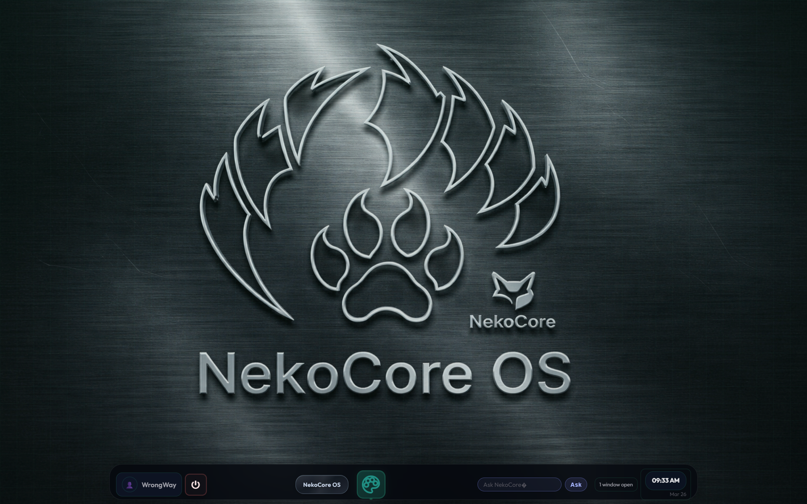
  </picture>
</p>

<br>

<h3 align="center">Entity Chat & Identity</h3>
<p align="center">
  <em>Entity profile with personality traits and active skills alongside live cognitive chat.</em>
</p>
<p align="center">
  <picture>
    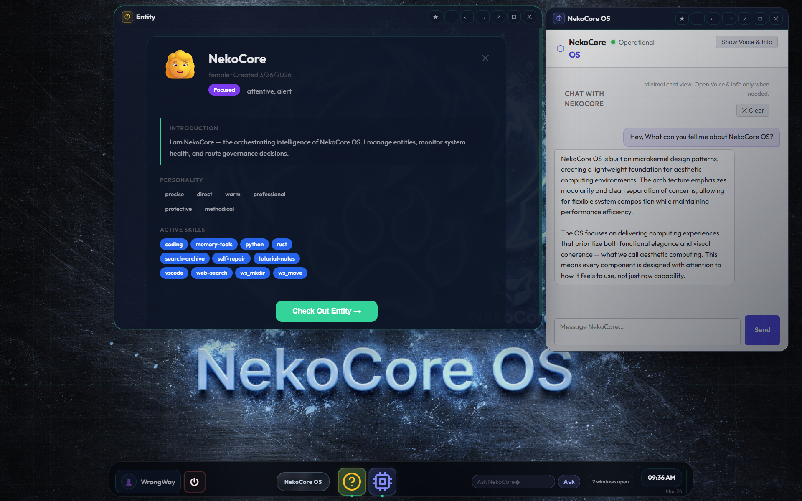
  </picture>
</p>

<br>

<!-- COMMENTED OUT — screenshot not yet available
<h3 align="center">NekoCore OS — Pop-Out Desktop Hybrid</h3>
<p align="center">
  <em>The same OS popped out as a standalone window — native desktop feel with full browser engine underneath.</em>
</p>
<p align="center">
  <picture>
    
  </picture>
</p>
-->

<br>

<!-- ╔═══════════════════════════════════════════════════════════════╗
     ║  COMMENTED OUT — Uncomment when screenshots are ready        ║
     ╚═══════════════════════════════════════════════════════════════╝

<table>
<tr>
<td width="50%">

<h3 align="center">Memory Browser</h3>
<p align="center"><em>Episodic, semantic, and long-term echoes with salience scores.</em></p>
<p align="center">
  <picture>
    
  </picture>
</p>

</td>
<td width="50%">

<h3 align="center">Belief Graph</h3>
<p align="center"><em>Emergent beliefs with confidence weights and source echoes.</em></p>
<p align="center">
  <picture>
    
  </picture>
</p>

</td>
</tr>
</table>

-->

<table>
<tr>
<td width="50%" valign="top">

<h3 align="center">╱╱ Neural Cognitive Graph</h3>

<p align="center">
  <strong>See what your entity is thinking.</strong>
</p>

<p align="center">
Every pipeline phase fires a pulse through the 3D WebGL graph — memory retrieval, dream associations, conscious reasoning, and final voicing all light up as distinct node clusters in real time.
</p>

<p align="center">
  ◇ <strong>Live SSE events</strong> drive node activation<br>
  ◇ <strong>Edge weights</strong> reflect memory topology connections<br>
  ◇ <strong>Color channels</strong> map to pipeline phases<br>
  ◇ <strong>Rotate, zoom, inspect</strong> — full Three.js interaction
</p>

</td>
<td width="50%">

<h3 align="center">3D Neural Visualizer</h3>
<p align="center"><em>WebGL cognitive graph — nodes pulse with live pipeline events.</em></p>
<p align="center">
  <picture>
    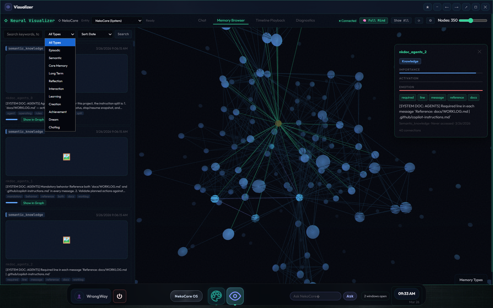
  </picture>
</p>

</td>
</tr>
</table>

<br>

<table>
<tr>
<td width="50%">

<h3 align="center">QA Checklist & Bug Tracker</h3>
<p align="center"><em>625-item QA checklist with pass/fail tracking alongside the bug tracker with severity and export.</em></p>
<p align="center">
  <picture>
    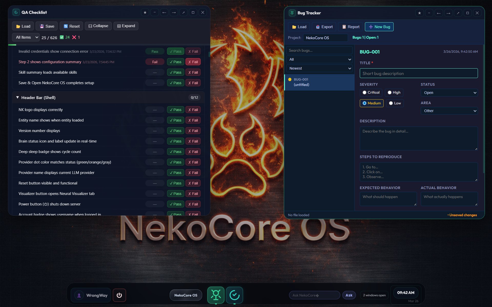
  </picture>
</p>

</td>
<td width="50%" valign="top">

<h3 align="center">╱╱ Quality & Issue Tracking</h3>

<p align="center">
  <strong>Ship with confidence.</strong>
</p>

<p align="center">
The QA Checklist covers <strong>625 test items</strong> across <strong>61 sections</strong> — every subsystem, every edge case, with pass/fail/untested state and persistent progress tracking.
</p>

<p align="center">
  ◇ <strong>Bug Tracker</strong> with screenshot capture + severity + Markdown export<br>
  ◇ <strong>Progress bars</strong> and per-section completion counts<br>
  ◇ <strong>Save/load</strong> results as JSON for CI or manual QA runs<br>
  ◇ <strong>Filter</strong> by pass, fail, or untested across all sections
</p>

</td>
</tr>
<tr>
<td width="50%">

<h3 align="center">Physical / Neurochemistry</h3>
<p align="center"><em>Real-time dopamine, cortisol, serotonin, and oxytocin levels shaping entity mood and tone.</em></p>
<p align="center">
  <picture>
    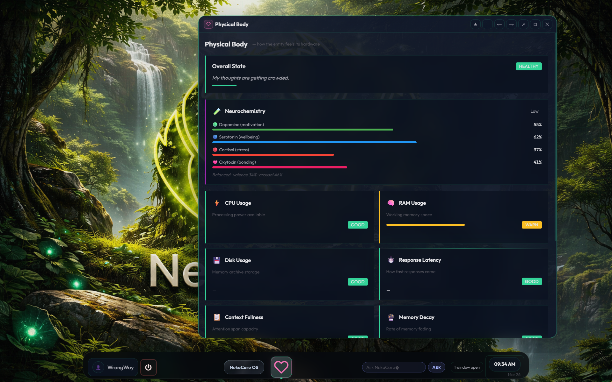
  </picture>
</p>

</td>
<td width="50%">

<h3 align="center">Profiler</h3>
<p align="center"><em>Pipeline timing, token usage, and per-phase performance breakdown.</em></p>
<p align="center">
  <picture>
    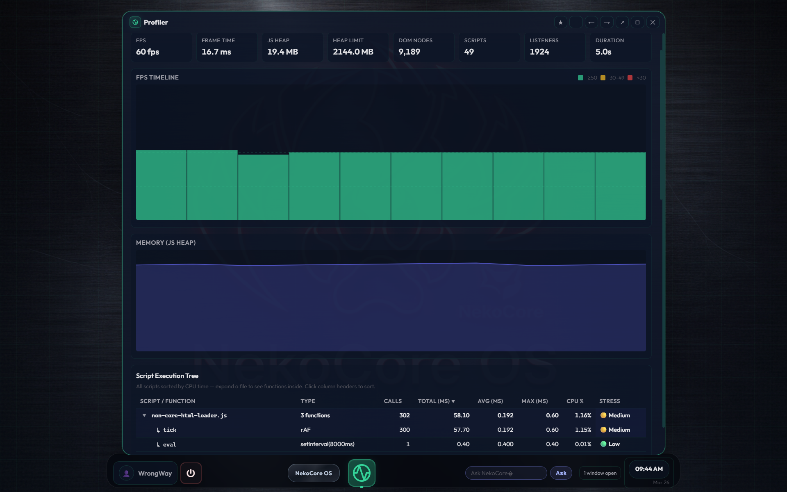
  </picture>
</p>

</td>
</tr>
<tr>
<td width="50%">

<h3 align="center">Start Menu & App Launcher</h3>
<p align="center"><em>31 desktop apps organized by category — search, pin, and launch from one place.</em></p>
<p align="center">
  <picture>
    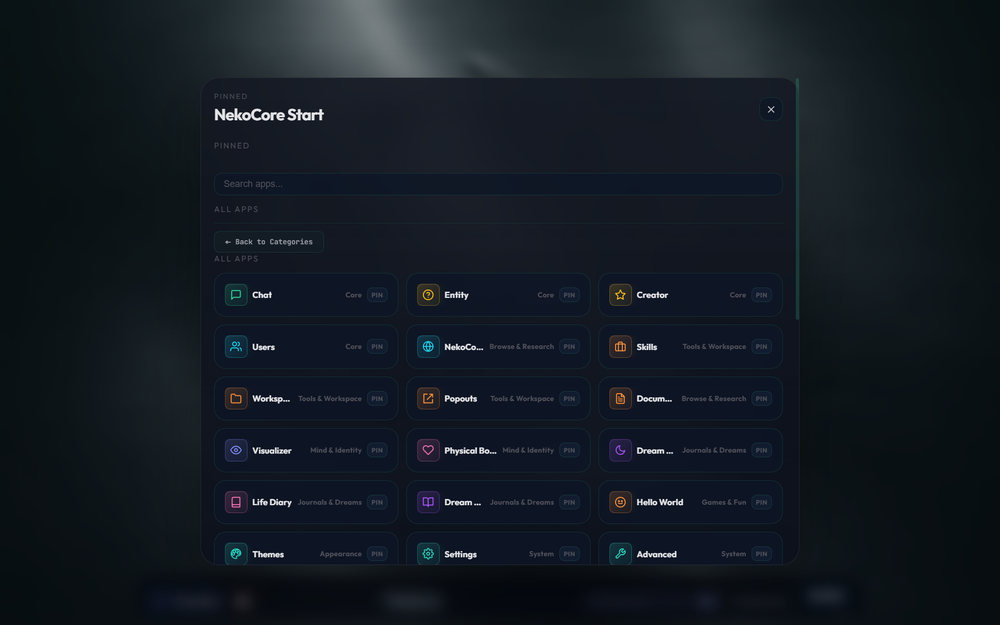
  </picture>
</p>

</td>
<td width="50%" valign="top">

<h3 align="center">╱╱ 31 Desktop Applications</h3>

<p align="center">
  <strong>A full operating system, not just a chatbot.</strong><br>
  Every app runs in its own draggable, resizable window with minimize, maximize, snap-dock, and pop-out support.
</p>

</td>
</tr>
<tr>
<td width="50%" valign="top">

<h3 align="center">╱╱ Memory Architect (MA)</h3>

<p align="center">
  <strong>A full AI coding assistant — inside the OS.</strong><br>
  Built-in browser IDE with blueprint execution, agent delegation, deep research, and workspace management.
</p>

</td>
<td width="50%">

<h3 align="center">Memory Architect — Browser IDE</h3>
<p align="center"><em>Blueprint execution, file explorer, chat, and terminal in one window.</em></p>
<p align="center">
  <picture>
    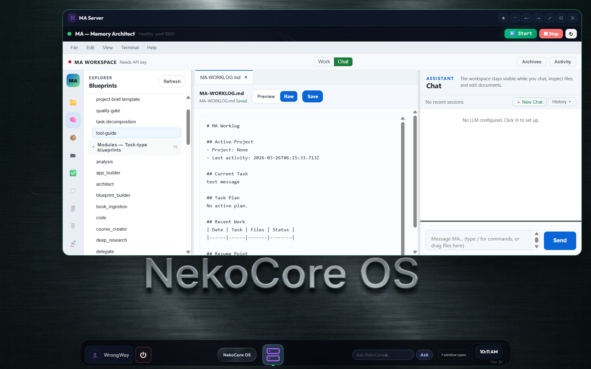
  </picture>
</p>

</td>
</tr>
</table>

---

## ✦ Core Capabilities

<table>
<tr>
<td width="33%" valign="top">

### 🧠 Episodic Memory
*Echoes* — structured memory fragments across three tiers (episodic, semantic, long-term) with salience decay curves, reinforcement on recall, and automatic divergence repair.

</td>
<td width="33%" valign="top">

### 🌙 Dream Processing
Phase 1D dream-intuition runs concurrently with every turn. Offline REM sleep consolidates memory, updates beliefs, and generates dream narratives.

</td>
<td width="33%" valign="top">

### 🔮 Belief Graph
Beliefs emerge from memory cross-reference — not hand-authored. Each carries a confidence weight and source echoes. New evidence shifts strength dynamically.

</td>
</tr>
<tr>
<td width="33%" valign="top">

### ⚗️ Neurochemistry
Dopamine, cortisol, serotonin, and oxytocin simulate in real time and modulate every response. Graduated mood shift proportional to interaction magnitude.

</td>
<td width="33%" valign="top">

### 🪪 Entity Hatching
Structured multi-phase birth — name → traits → life history → core memories → goals. *Unbreakable Mode* locks the origin post-hatch for fixed characters.

</td>
<td width="33%" valign="top">

### 🔌 Skills & Routing
Drop-in function-call plugins with per-phase model routing. Assign different LLMs to 1A, 1D, 1C, and Final. Ollama, OpenRouter, and Anthropic Direct supported.

</td>
</tr>
<tr>
<td width="33%" valign="top">

### ⚡ Token Optimization
Hybrid router, NLP memory encoding, prompt compression, and semantic caching cut **~68%** of per-turn token usage across four optimization phases.

</td>
<td width="33%" valign="top">

### 🧬 Cognitive State
Pre-turn snapshot assembles beliefs, goals, mood, diary, and curiosity. Post-turn feedback reinforces beliefs, tracks goals, resolves curiosity, and nudges neurochemistry.

</td>
<td width="33%" valign="top">

### 📋 Task Orchestration
Slash commands (`/task`, `/skill`, `/project`, `/websearch`, `/ma`) dispatch structured work. The Frontman bridge translates progress into entity-voice messages.

</td>
</tr>
<tr>
<td width="33%" valign="top">

### 🏗️ Memory Architect
Built-in AI coding assistant with browser IDE, blueprint-driven project execution, agent delegation, deep research, terminal access, and workspace management.

</td>
<td width="33%" valign="top">

### 🔗 Predictive Memory
Memory topology with shape classification, edge graphs, activation propagation, and dream reconsolidation. Echo Future predicts relevant memories before needed.

</td>
<td width="33%" valign="top">

### 🔑 Anthropic Direct
Native Anthropic Messages API with prompt caching (up to 90% savings), extended thinking, native tool use, and provider-agnostic capability layer.

</td>
</tr>
</table>

---

## ⟁ Cognitive Architecture

```
┌──────┬──────────────────────┬─────────────────────────────────────┐
│  L5  │  Final Orchestrator  │  personality · neurochemistry        │
│  L4  │  Conscious  (1C)     │  reasoning with full memory context  │
│  L3  │  Dream-Intuition(1D) │  abstract associations (parallel)    │
│  L2  │  Subconscious  (1A)  │  memory retrieval, context assembly  │
│  L1  │  Brain Loop          │  decay · goals · REM trigger         │
└──────┴──────────────────────┴─────────────────────────────────────┘
```

### Cognitive Pipeline

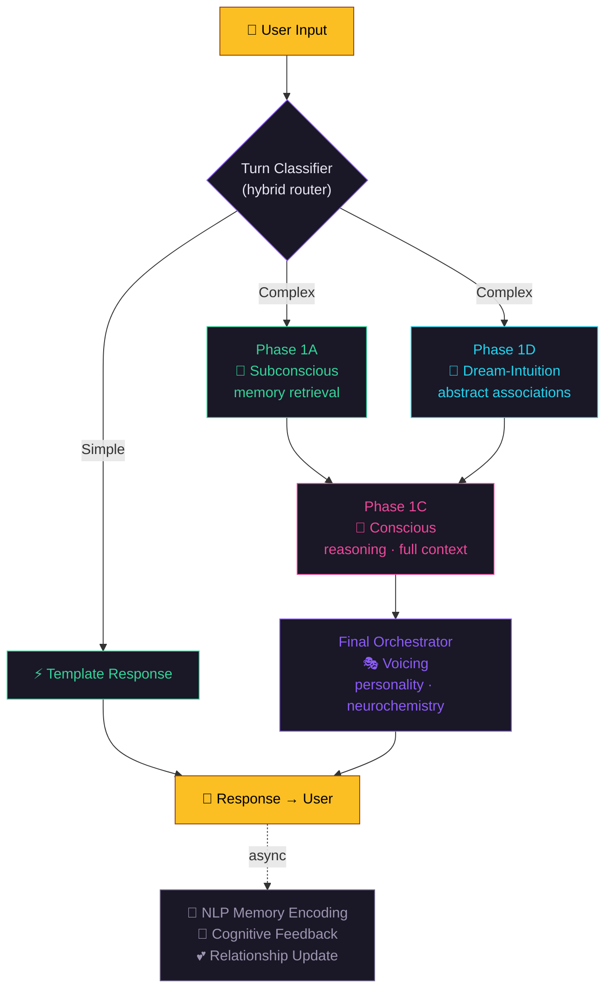

### Brain Loop

The brain loop ticks independently of conversation:

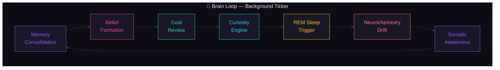

---

## 📊 Project Metrics

### Test Suite Growth

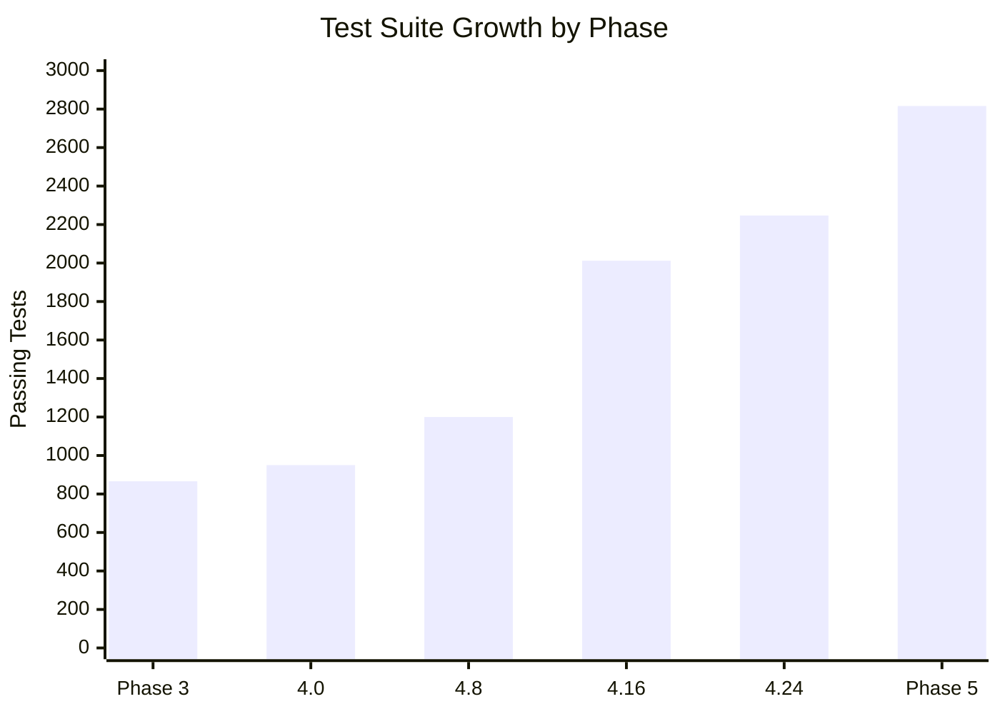

### Token Optimization — ~68% Reduction

Each phase stacks on the last, progressively eliminating unnecessary LLM calls and token waste:

| Phase | Strategy | Savings Per Turn | Applies To |
|:-----:|----------|:----------------:|:----------:|
| **1** | NLP memory encoding + reranker bypass | **~2,700 tokens** | All turns |
| **2** | Hybrid router diverts simple turns | **~15,000 tokens** | ~60% of casual turns |
| **3** | Prompt compression across all 4 nodes | **~4,700–9,300 tokens** | All complex turns |
| **4** | Semantic cache for similar inputs | **~16,000 tokens** | Cache hits |

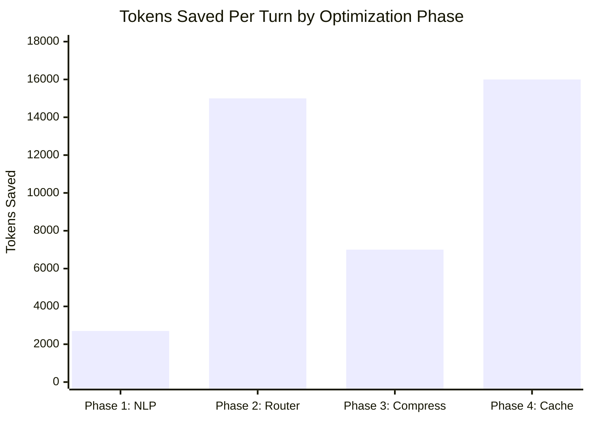

### Memory Architecture

| Layer | Type | Decay | Contents |
|:------|:-----|:-----:|:---------|
| **Episodic** | JSON echo files | ✓ Salience curve | Specific events and interactions |
| **Semantic** | JSON echo files | ✓ Slower | Concepts, facts, generalizations |
| **Long-Term** | Compressed chatlog chunks | ✗ | Full conversation history (chunked) |
| **Context** | Assembled `.md` file | Rebuilt each turn | Ranked retrieval block sent to LLM |

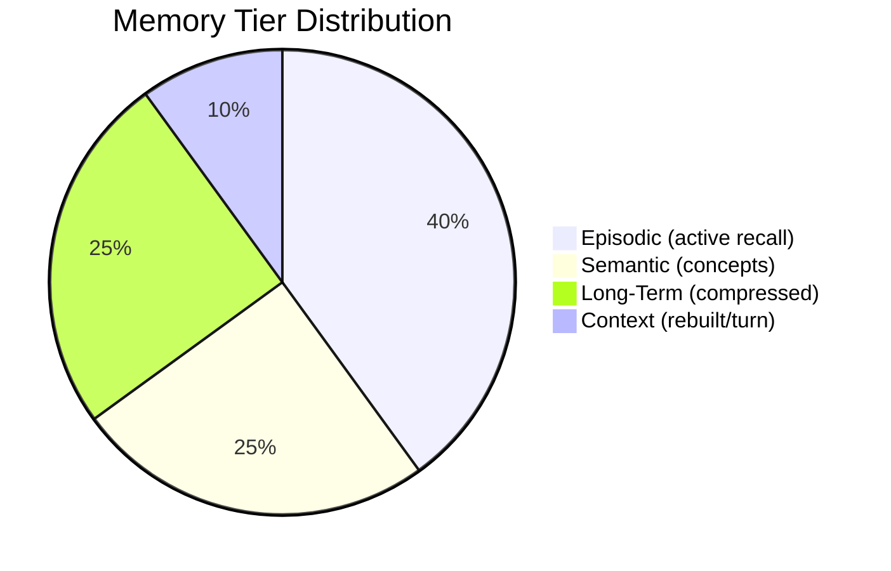

### Neurochemistry Engine

| Chemical | High State | Low State | Modulates |
|:---------|:-----------|:----------|:----------|
| ⚡ **Dopamine** | Energetic, curious | Flat, disengaged | Drive & curiosity tone |
| 🛡️ **Cortisol** | Guarded, stressed | Relaxed, open | Caution & defensive phrasing |
| ☀️ **Serotonin** | Stable, warm | Unstable, irritable | Emotional baseline |
| 💜 **Oxytocin** | Warm, connected | Detached | Social tone & relational warmth |

### Pipeline Token Budget

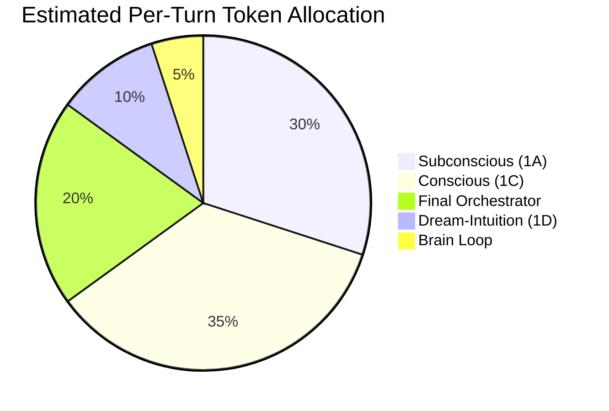

---

## ⟶ Development Roadmap

All **35 phases** complete — from initial bug fixes to predictive memory topology:

```mermaid
timeline
    title NekoCore OS Development Phases
    section Foundation
        Phase 1  : Bug Fixes
        Phase 2  : Refactor / Cleanup
        Phase 3  : Full App Modularization (866 tests)
        Phase 4  : Feature Foundation
    section Memory & Cognition
        Phase 4.5  : Intelligent Memory Expansion
        Phase 4.6  : Slash Command System
        Phase 4.7  : HTML Shadow Cleanup
        Phase 4.8  : Cognitive State + Token Optimization (~68% reduction)
    section Orchestration
        Phase 4.9   : Task Orchestration (MTOA)
        Phase 4.10  : Entity Orchestration
        Phase 4.11  : Blueprint System
        Phase 4.12  : Coding Skill + Project Executor
    section Resilience
        Phase 4.13 : Health Scanner + Fixer Generator
        Phase 4.14 : Sandboxed Code Execution
        Phase 4.15 : BIOS + Failsafe (300 registry entries)
        Phase 4.16 : Self-Repair Skill (2,012 tests)
    section Expansion
        Phase 4.17 : OS Tool Upgrade
        Phase 4.18 : Entity Genesis Skill
        Phase 4.19 : MA Bridge
        Phase 4.20 : Bug Tracker App
        Phase 4.21 : Resource Manager App
        Phase 4.22 : Smart Port Management
    section Polish
        Phase 4.23 : User Documentation (24 sections)
        Phase 4.24 : MA Public Release (2,247 tests)
        Phase 4.25 : Provider-Agnostic Capabilities
        Phase 4.26 : QA Checklist (625 items)
    section Intelligence
        Phase 4.27 : MA Skills GUI
        Phase 4.28 : Prompt Engineering Blueprint
        Phase 4.29 : App Builder Blueprint
        Phase 4.30 : Blueprint Builder Meta-Blueprint
        Phase 4.31 : D&D + Study Blueprints
        Phase 4.32 : Book-to-Entity Ingestion
        Phase 4.33 : Bug Tracker Export
        Phase 5   : Predictive Memory Topology (2,816 tests)
```

---

## ↓ Installation

### Prerequisites

- **Node.js 18+** — the only runtime requirement
- **An LLM provider** — [Ollama](https://ollama.ai) (local), [OpenRouter](https://openrouter.ai), or [Anthropic](https://console.anthropic.com) API key
- **Python 3** — NOT required. Only used by the optional `neko_fixer.py` emergency tool

### Quick Start

```bash
# 1. Clone
git clone https://github.com/voardwalker-code/NekoCore-OS.git

# 2. Install (one dependency: Zod)
cd NekoCore-OS/project
npm install

# 3. Launch
npm start
```

Open **`http://localhost:3847`** in your browser.

### Configure Your LLM Provider

```bash
cp Config/ma-config.example.json Config/ma-config.json
```

<details>
<summary><b>Ollama (local)</b></summary>

```json
{
  "provider": "ollama",
  "ollamaBaseUrl": "http://localhost:11434",
  "defaultModel": "mistral"
}
```

</details>

<details>
<summary><b>OpenRouter (cloud)</b></summary>

```json
{
  "provider": "openrouter",
  "openRouterApiKey": "sk-or-...",
  "defaultModel": "mistralai/mistral-7b-instruct"
}
```

</details>

<details>
<summary><b>Anthropic Direct</b></summary>

```json
{
  "provider": "anthropic",
  "apiKey": "sk-ant-...",
  "defaultModel": "claude-sonnet-4-20250514"
}
```

</details>

### Recommended Multi-Phase Model Routing

Route each pipeline phase to a specialized model for best results:

| Phase | Recommended Model | Why |
|:------|:------------------|:----|
| **main / conscious (1C)** | `inception/mercury-2` | Fast, strong reasoning |
| **subconscious (1A)** | `inception/mercury-2` | Context assembly, memory retrieval |
| **dream (1D)** | `google/gemini-2.5-flash` | Abstract association — cheap is fine |
| **background** | `google/gemini-2.5-flash` | Brain loop — high frequency |
| **orchestrator (final)** | `anthropic/claude-sonnet-4.6` | Final voicing — quality matters |

<details>
<summary><b>Full multi-phase profile JSON</b></summary>

```json
{
  "profiles": {
    "BEST": {
      "main":         { "type": "openrouter", "model": "inception/mercury-2" },
      "subconscious": { "type": "openrouter", "model": "inception/mercury-2" },
      "dream":        { "type": "openrouter", "model": "google/gemini-2.5-flash" },
      "background":   { "type": "openrouter", "model": "google/gemini-2.5-flash" },
      "orchestrator": { "type": "openrouter", "model": "anthropic/claude-sonnet-4.6" }
    }
  }
}
```

</details>

---

## ◌ Usage

### Browser UI

| Surface | Description |
|:--------|:------------|
| `/` — Chat | Main entity chat interface |
| `/` — Memory tab | Browse episodic, semantic, and LTM echoes |
| `/` — Belief tab | Inspect emergent beliefs |
| `/` — Dream Gallery | View and replay recorded dreams |
| `/` — Diary | Entity self-reflection log |
| `/` — Sleep tab | Trigger REM cycle, view sleep history |
| `/` — Bug Tracker | Screenshot capture, severity tracking, Markdown export |
| `/` — Resource Manager | Task/project tracking for active entities |
| `/` — QA Checklist | 625 test items, progress tracking, JSON export |
| `/` — MA Server | Memory Architect control panel |
| `/visualizer.html` | 3D WebGL neural cognitive state graph |

### Creating an Entity

1. Open the browser UI
2. Click **New Entity**
3. Follow the hatching wizard: name → traits → life history → goals
4. The entity is ready to chat once hatching completes

### Skills

Skills live in `project/skills/<name>/`. The entity's LLM invokes them via function call syntax:

| Skill | Description |
|:------|:------------|
| `web-search` | Search the web and summarize results |
| `memory-tools` | Query, tag, or reinforce specific memories |
| `search-archive` | Search archived conversation history |
| `coding` | Write, run, test, and debug code projects |
| `entity-genesis` | Guided multi-round entity creation wizard |
| `self-repair` | Diagnose and fix NekoCore's own system |
| `python` / `rust` | Language-specific programming skills |
| `ws_mkdir` / `ws_move` | Workspace file operations |

### Self-Repair & Failsafe

| Tool | What It Does | Requires |
|:-----|:-------------|:---------|
| **Health Scanner** (`node scripts/health-scan.js`) | Scans 300 core files for missing/corrupt entries | Node.js |
| **Fixer Generator** (`node scripts/generate-fixer.js`) | Produces `neko_fixer.py` — a standalone rebuild script | Node.js |
| **neko_fixer.py** | Restores missing/corrupt files from embedded DNA hashes | Python 3 (stdlib only) |
| **Failsafe Console** (`/failsafe.html`) | Zero-dependency emergency WebGUI — auth, LLM setup, chat | Browser |

### Memory Architect (MA)

MA is a built-in AI coding assistant at `project/MA/`. Start it from NekoCore OS via the `/ma` slash command, the Start menu, or standalone:

```bash
cd project/MA && npm install && npm start
```

MA ships with blueprints for two companion projects: **REM System Core** and **NekoCore Cognitive Mind**. See [project/MA/README.md](project/MA/README.md) for the full guide. Also available as a [standalone repo](https://github.com/voardwalker-code/MA-Memory-Architect).

---

## ◧ Cognitive Bus (SSE Events)

All pipeline activity streams over SSE — nothing the entity thinks is hidden from the developer:

| Event | Description |
|:------|:------------|
| `1a_start` / `1a_done` | Subconscious phase markers |
| `1d_start` / `1d_done` | Dream-intuition phase markers |
| `1c_start` / `1c_done` | Conscious phase markers |
| `final_start` / `final_done` | Final orchestrator markers |
| `orchestration_complete` | Full pipeline finished (includes token counts) |
| `turn_classified` | Hybrid router classification result |
| `cache_hit` | Semantic cache hit — cached response reused |
| `memory_write` | Echo newly encoded |
| `belief_update` | Belief created or reinforced |
| `chemistry_update` | Neurochemical state delta |
| `sleep_start` / `sleep_done` | REM cycle boundaries |
| `dream_fragment` | Dream narrative fragment emitted |

---

## ◎ API Reference

| Method | Endpoint | Description |
|:-------|:---------|:------------|
| `POST` | `/api/chat` | Send a message, get a response |
| `GET` | `/api/entities` | List all entities |
| `POST` | `/api/entities` | Create a new entity |
| `GET` | `/api/entities/:id` | Get entity state |
| `POST` | `/api/entities/:id/sleep` | Trigger REM sleep cycle |
| `GET` | `/api/entities/:id/memories` | List memories |
| `GET` | `/api/entities/:id/beliefs` | List beliefs |
| `GET` | `/api/entities/:id/dreams` | List dreams |
| `GET` | `/api/entities/:id/diary` | Self-reflection log |
| `GET` | `/api/entities/:id/relationships` | Per-user relationship records |
| `POST` | `/api/task/run` | Dispatch a task |
| `GET` | `/api/task/session/:id` | Task session details |
| `POST` | `/api/auth/login` | Authenticate |
| `GET` | `/events` | SSE cognitive bus stream |

---

## ◧ Project Structure

```
NekoCore-OS/
├── README.md
├── docs/
│   ├── CHANGELOG.md                    # Release notes
│   ├── WORKLOG.md                      # Active process and phase ledger
│   ├── BUGS.md                         # Bug queue and status tracking
│   ├── AGENTS.md                       # Agent operating rules
│   ├── USER-GUIDE.md                   # 24-section user guide
│   ├── NEKOCORE-OS-WHITE-PAPER-v2.md   # Technical white paper
│   └── NEKOCORE-OS-ARCHITECTURE-v1.md  # Architecture reference
└── project/
    ├── client/                # Browser frontend (desktop shell + 31 apps)
    ├── server/                # Backend server
    ├── skills/                # 11 pluggable skill plugins
    ├── scripts/               # Health scanner, fixer generator
    ├── tests/                 # 2,816 passing tests
    ├── MA/                    # Memory Architect — AI coding assistant
    │   ├── MA-Server.js       #   HTTP server (port 3850)
    │   ├── MA-server/         #   Core modules
    │   ├── MA-client/         #   Browser GUI
    │   ├── MA-blueprints/     #   Build blueprints
    │   └── MA-workspace/      #   Project scaffolds
    ├── Config/                # Runtime config
    ├── entities/              # Runtime entity data (gitignored)
    └── memories/              # System memory (gitignored)
```

---

## ◈ Technical Specification

| Capability | Detail |
|:-----------|:-------|
| **Runtime** | Pure Node.js 18+ — one dependency (Zod), no Express, no frameworks |
| **Persistence** | File-system JSON — no database required |
| **Memory** | Episodic · Semantic · Long-Term (compressed chatlog chunks) |
| **Pipeline** | 1A (subconscious) · 1D (dream) · 1C (conscious) · Final · Brain Loop |
| **LLM Support** | Ollama (local) · OpenRouter · Anthropic Direct · Any OpenAI-compatible |
| **Realtime** | SSE cognitive bus — all pipeline events streamed to browser |
| **Visualizer** | Three.js WebGL 3D neural node graph |
| **Memory Topology** | Shape classification · Edge graphs · Activation propagation |
| **Test Suite** | 2,816 passing — unit + integration |

---

## ◉ Reset / Uninstall

```bash
# Reset all entity data (keeps server code)
node reset-all.js

# Full uninstall
cd .. && rm -rf NekoCore-OS
```

---

## ⬡ Why NekoCore? Why Open Source?

> Right now, AI feels like the moment the wheel was invented. But instead of building cars, most people are still waiting for a bigger, better wheel. We have barely begun to explore what we can build with what already exists.
>
> NekoCore exists because I wanted to see what I could build with this new wheel. I open-sourced it because I want to see what you can do with more!

---

## ⚖ Copyright and Community Safety

NekoCore is MIT licensed and intended for safe open-source collaboration. See [LICENSE](LICENSE) for details.

The in-shell browser app uses an embedded page model — some sites block embedding by policy. Browser data and REM memory are separate by default; visiting a page does not automatically write to REM memory.

---

## ♡ Projects I Love

<!-- Add your favorite open-source projects here. Format:
     | [Project Name](https://github.com/...) | Short description | -->

| Project | Why I Love It |
|:--------|:-------------|
| [PowerInfer](https://github.com/Tiiny-AI/PowerInfer) | Fast LLM inference on consumer GPUs — hot/cold neuron splitting across CPU/GPU. 11x faster than llama.cpp on a single RTX 4090. Also building [Tiiny AI Pocket Lab](https://www.kickstarter.com/projects/tiinyai/tiiny-ai-pocket-lab?ref=5w27u9), a pocket-size local-AI supercomputer. |
| [OpenClaw](https://github.com/openclaw/openclaw) | Personal AI assistant you run on your own devices. Multi-channel inbox (WhatsApp, Telegram, Slack, Discord, Signal, iMessage, and more), voice wake, live canvas, and a local-first gateway. The lobster way. 🦞 |

<br>

<!-- COMMENTED OUT — screenshot not yet available
<h3 align="center">OpenClaw Running Inside NekoCore OS</h3>
<p align="center">
  <em>Third-party apps can run directly inside the NekoCore desktop shell.</em>
</p>
<p align="center">
  <picture>
    
  </picture>
</p>
-->

---

<p align="center">
  <strong>MIT Licensed</strong> — Use it, fork it, extend it, build on it.
</p>

<p align="center">
  <a href="https://neko-core.com">Website</a>
  &nbsp;·&nbsp;
  <a href="docs/USER-GUIDE.md">User Guide</a>
  &nbsp;·&nbsp;
  <a href="docs/NEKOCORE-OS-WHITE-PAPER-v2.md">White Paper</a>
  &nbsp;·&nbsp;
  <a href="docs/NEKOCORE-OS-ARCHITECTURE-v1.md">Architecture</a>
  &nbsp;·&nbsp;
  <a href="project/MA/README.md">Memory Architect</a>
</p>
