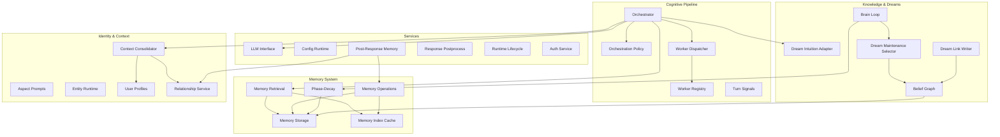
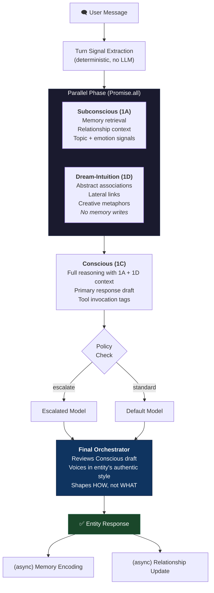
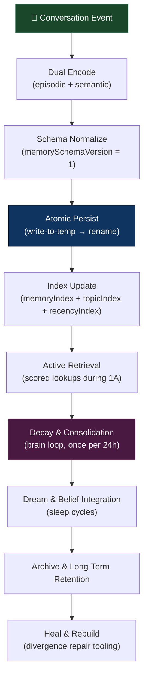
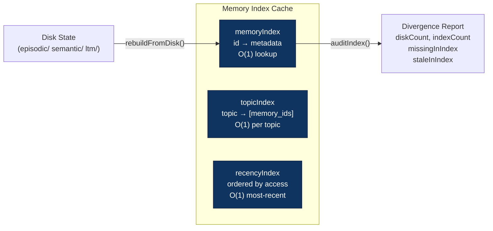
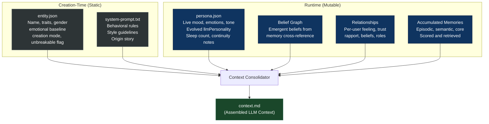
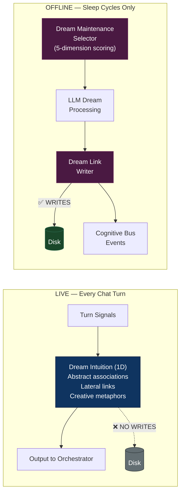
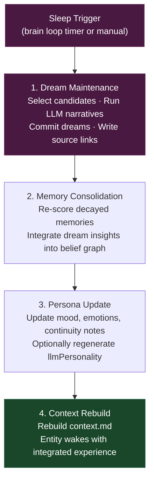
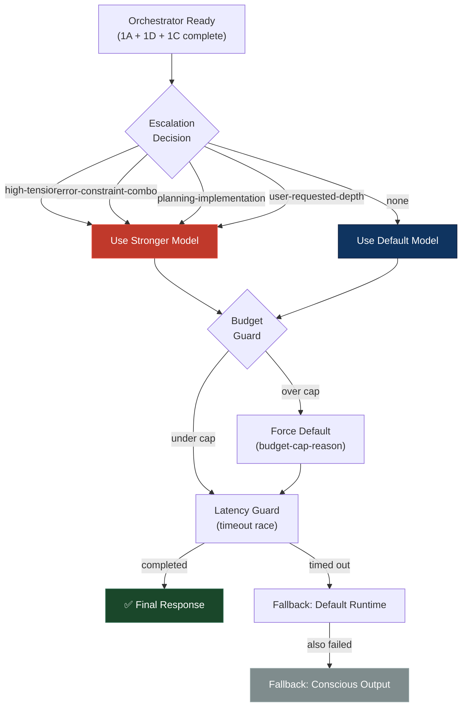
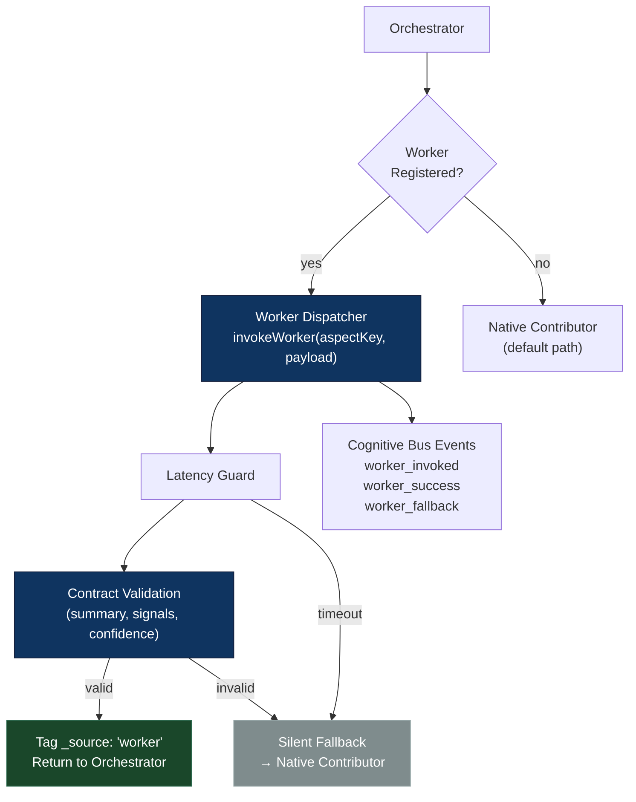
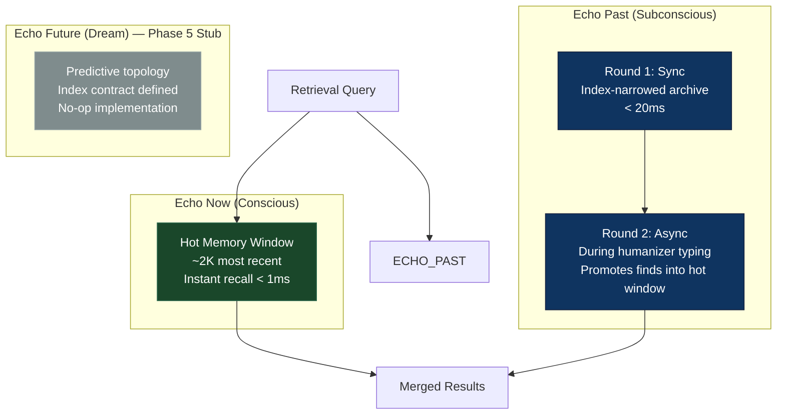

# NekoCore OS: Architecture of a Persistent-Agent Cognitive Operating System

**Version:** 1.0 — Architecture Reference Paper
**Date:** 2026-03-17
**System Version:** 0.6.0+

---

## Abstract

NekoCore OS is a near-zero-dependency Node.js cognitive operating system that provides persistent AI entities with continuous memory, evolving identity, belief formation, dream processing, and per-user relationship tracking across sessions. Its single required dependency is Zod (schema validation). The system sits between a desktop-style web interface and one or more LLM providers, treating each entity not as a stateless chatbot but as a long-lived agent whose operational identity is shaped by accumulated experience. This paper presents the complete architecture of NekoCore OS, covering its four-stage parallel cognitive pipeline, multi-layer memory system with bounded token injection, dual dream architecture, contract-governed extensibility model, and policy-controlled orchestration layer. All descriptions reference implemented, running code unless explicitly marked as planned.

---

## 1. Introduction

### 1.1 Motivation

Contemporary LLM applications typically treat each conversation as an isolated event. The model receives a system prompt and a conversation history, generates a response, and forgets everything. Persistent state, when it exists, is usually limited to retrieval-augmented generation (RAG) over a document store — a mechanism designed for knowledge lookup, not experiential continuity.

NekoCore OS takes a different position: an AI entity should be shaped by what it has experienced, not only by what it was told on day one. The system implements this conviction through a layered architecture where memory, identity, belief, and emotional state are first-class runtime concerns that persist across sessions, evolve through sleep cycles, and influence every response the entity generates.

### 1.2 Design Convictions

Five architectural convictions guide the system:

1. **Evolution over origin.** An entity's lived experience takes precedence over its starting description. The origin story is placed last in LLM context, not first.
2. **Parallel decomposition over monolithic prompting.** Cognitive work is split across specialized contributors that run concurrently, each with a defined responsibility and contract.
3. **Bounded injection over unbounded retrieval.** Memory context sent to the LLM is capped at fixed limits regardless of archive size, producing constant per-turn token cost.
4. **Contracts at boundaries.** Every inter-module interface is governed by an explicit schema or contract, enabling safe internal refactoring.
5. **Inspectability by default.** Every pipeline stage emits structured telemetry to a cognitive event bus, making the system's reasoning process observable in real time.

### 1.3 Paper Scope

This paper describes the architecture of NekoCore OS as implemented at version 0.6.0+. Claims are grounded in source code. Where planned but unimplemented components are discussed (Agent Echo retrieval pipeline, entity-to-entity relay infrastructure), they are explicitly marked as such.

---

## 2. System Overview

### 2.1 High-Level Stack

NekoCore OS is organized into six architectural layers, from the user-facing shell down to persistent storage:

```
┌─────────────────────────────────────────────────────────┐
│                   DESKTOP SHELL LAYER                   │
│   Window manager · App launcher · Start menu · Taskbar  │
│   Theme engine · Settings · Browser · Creator · Users   │
├─────────────────────────────────────────────────────────┤
│                   CLIENT APPLICATION                    │
│    Chat UI · Entity management · Neural visualizer      │
│    Timeline playback · Diagnostic panels                │
├─────────────────────────────────────────────────────────┤
│                    API / ROUTE LAYER                    │
│  auth · chat · entity · memory · brain · cognitive      │
│  config · sse · skills · browser · document             │
├─────────────────────────────────────────────────────────┤
│               COGNITIVE PIPELINE LAYER                  │
│  Orchestrator · Contributors (1A, 1D, 1C, Final)        │
│  Policy engine · Worker subsystem · Turn signals        │
├─────────────────────────────────────────────────────────┤
│                   SERVICES LAYER                        │
│  Memory ops · Retrieval · Relationships · User profiles │
│  LLM interface · Config runtime · Entity runtime        │
│  Post-response encoding · Response postprocessing       │
├─────────────────────────────────────────────────────────┤
│                 PERSISTENT STATE LAYER                  │
│  Entity folders · Memory files · Belief graph · Indexes │
│  Persona state · Relationship records · Session data    │
└─────────────────────────────────────────────────────────┘
```

**Figure 1.** High-level NekoCore OS system stack. Each layer communicates only with its immediate neighbors. The cognitive pipeline never touches the DOM; the client never touches the filesystem.

### 2.2 Technology Constraints

| Property | Value |
|----------|-------|
| Runtime | Node.js (server) + vanilla HTML/CSS/JS (client) |
| Framework dependencies | Zero — no Express, no React, no ORM |
| LLM providers | OpenRouter, Ollama, any OpenAI-compatible endpoint |
| Storage | Flat-file JSON/TXT with atomic write-to-temp-then-rename |
| Transport | HTTP REST + Server-Sent Events (SSE) |
| Test framework | Node.js built-in `node:test` |

The near-zero-dependency constraint is enforced at the server level. The only required dependency is Zod (schema validation). The only optional dependencies (`@napi-rs/canvas`, `gif-encoder-2`) are lazy-loaded for pixel art generation and are not required for core operation.

### 2.3 Subsystem Map



**Figure 2.** Subsystem dependency graph. Arrows indicate runtime call direction. The orchestrator is the central coordinator; services below it are stateless factories injected at startup.

---

## 3. Cognitive Pipeline

The cognitive pipeline is the core runtime path that transforms a user message into an entity response. It executes four synchronous LLM calls per turn, plus up to two asynchronous post-turn operations.

### 3.1 Pipeline Flow



**Figure 3.** Live cognitive pipeline. Subconscious (1A) and Dream-Intuition (1D) execute in parallel via `Promise.all`. Conscious (1C) waits for both before reasoning. The Final Orchestrator applies voice and review. Post-turn memory encoding and relationship updates run asynchronously after the response is sent.

### 3.2 Turn Signal Extraction

Before any LLM call, the user message is preprocessed deterministically (no LLM required) to extract structured turn signals:

```json
{
  "subject":  "primary topic of the message",
  "event":    "what is happening or being requested",
  "emotion":  "detected emotional tone (neutral if none)",
  "tension":  0.0,
  "raw":      "original message text"
}
```

Turn signals are passed to all contributor phases, providing a shared structured representation of the user's intent without consuming LLM tokens for basic extraction.

### 3.3 Contributor Phases

#### 3.3.1 Subconscious (1A)

The subconscious contributor assembles the entity's experiential context for the current turn:

1. **Topic extraction** — User message → keyword extraction → stopword filter → max 12 topics
2. **Index lookup** — O(1) per topic via the in-memory topic index, with substring fallback
3. **Scoring** — `relevanceScore = baseWeight × (0.35 + importance × decay)`
4. **Relationship injection** — Current user's relationship record (feeling, trust, beliefs, summary)
5. **Conversation recall** — Reconstructed recent chatlog for session continuity
6. **Filtering** — `doc_*` entries excluded (document ingestion chunks are not experiential memories); boilerplate entries excluded (corrupted system context captures)

Output: a structured `memoryContext` block containing activated memories, conversation recall, and relationship state.

#### 3.3.2 Dream-Intuition (1D)

The live creativity layer. Receives turn signals and generates abstract associations, lateral links, and creative metaphors — adding depth beyond literal memory recall.

**Critical architectural constraint:** Dream-Intuition has no memory write access. This is enforced by guard tests that verify the adapter module contains zero disk-write call sites. The intuition layer is purely generative — it is the difference between "what comes to mind immediately" and "what gets processed overnight."

#### 3.3.3 Conscious (1C)

The primary reasoning phase. Waits for both 1A and 1D to complete, then receives:
- Turn signals (structured user intent)
- Memory context from 1A (activated memories, relationship, conversation recall)
- Dream associations from 1D (creative links)

Produces a full response draft. Can request tool invocations via `[TOOL: ...]` tags or multi-step plans via `[TASK_PLAN]` blocks (mutually exclusive — tools take priority).

#### 3.3.4 Final Orchestrator

The Final Orchestrator is a reviewer and voicer, not a re-synthesizer. It receives:
- The user message
- A full copy of everything Conscious had (1A context, 1D output, turn signals)
- The Conscious draft (1C output)

Its role: review the draft for coherence and fit, then deliver it in the entity's authentic voice. The Orchestrator shapes *how* something is said, not *what* is said. It passes through tool tags and task plan blocks unchanged.

### 3.4 LLM Call Budget Per Turn

| Phase | Type | Purpose |
|-------|------|---------|
| 1A — Subconscious | Synchronous | Memory retrieval context assembly |
| 1D — Dream-Intuition | Synchronous (parallel with 1A) | Creative association generation |
| 1C — Conscious | Synchronous | Primary reasoning and draft |
| Final Orchestrator | Synchronous | Voice and review |
| Chatlog reconstruction | Synchronous (inside 1A, conditional) | Recent conversation recall |
| Memory encoding | Asynchronous (post-turn) | Episodic + semantic memory creation |
| Relationship update | Asynchronous (post-turn) | Per-user relationship delta |

**Base cost:** 4 synchronous LLM calls + up to 2 asynchronous post-turn calls. The async calls do not block the user — the response is already sent.

---

## 4. Memory System

### 4.1 Memory Types

| Type | Storage | Purpose | Decay |
|------|---------|---------|-------|
| **Episodic** | `memories/episodic/` | Individual conversation events | Yes |
| **Semantic** | `memories/semantic/` | Abstracted knowledge from episodes | Exempt |
| **Long-Term (LTM)** | `memories/ltm/` | Compressed chatlog chunks | Yes |
| **Core** | `memories/episodic/` (high importance) | High-importance events | Shielded |

Each memory is a folder containing three files:

```
mem_<timestamp>_<random>/
    log.json       — metadata (id, type, topics, importance, decay, timestamps)
    semantic.txt   — plain-text content (this is what the LLM reads)
    memory.zip     — compressed full content for reconstruction
```

### 4.2 Memory Lifecycle



**Figure 4.** Memory lifecycle from conversation event to long-term retention. Atomic persistence prevents partial-write corruption. Decay runs on a 24-hour brain loop cycle. Dream integration occurs during sleep.

### 4.3 Memory Schema (Version 1)

All memory records are normalized through `normalizeMemoryRecord()` before persistence:

```
Field                  Type        Description
─────────────────────────────────────────────────────
memorySchemaVersion    integer     Always 1
memory_id              string      Unique identifier
type                   enum        episodic | semantic | ltm | core
created                ISO string  Creation timestamp
last_accessed          ISO string  Last retrieval timestamp
access_count           integer     Total access count
access_events          string[]    Array of access timestamps
decay                  float       0.0–1.0 (1.0 = fully fresh)
importance             float       0.0–1.0
topics                 string[]    Topic tags
emotionalTag           string      Emotional classification
```

### 4.4 Decay System

Memory decay follows an importance-shielded exponential model:

$$\text{newDecay} = \text{currentDecay} \times (1 - \text{decayFactor})$$

$$\text{decayFactor} = \text{baseDecayRate} \times (1 - \text{importance} \times 0.7)$$

| Importance | Effective Decay Rate / Day |
|-----------|---------------------------|
| 0.9 | ~0.37% |
| 0.7 | ~0.51% |
| 0.5 | ~0.65% |
| 0.1 | ~0.93% |

- **Base rate:** 0.01 (1% per brain-loop day)
- **Floor:** 0.1 — memories never fully vanish
- **Semantic knowledge:** exempt from decay entirely

### 4.5 Retrieval Scoring

When a user message arrives, the subconscious phase scores candidate memories:

$$\text{relevanceScore} = \text{baseWeight} \times (0.35 + \text{importance} \times \text{decay})$$

$$\text{baseWeight} = \max(1, \text{numTopics} - \text{topicIndex})$$

Earlier-extracted topics receive higher base weight, reflecting their likely greater relevance to the user's intent.

**Optional LLM rerank** blends lexical score (45%) with LLM semantic score (55%) for deeper contextual matching.

**Zero-match fallback:**
$$\text{score} = \text{importance} \times 0.7 + \text{decay} \times 0.3$$

This ensures the entity always has *something* to work with, surfacing the most important recent memories even when no topic matches occur.

### 4.6 Bounded Token Injection

A critical architectural property: the number of memory tokens injected into each LLM call is bounded regardless of total archive size.

| Injection Path | Limit | Source |
|---------------|-------|--------|
| Core memories | `slice(0, 30)` | `context-consolidator.js` |
| Regular memories | `slice(0, 40)` | `context-consolidator.js` |
| Subconscious retrieval | `limit = 36` | `memory-retrieval.js` |

These paths are additive but each is independently capped. An entity with 50 memories and an entity with 50,000 memories pay the same per-turn token cost. Scaling the archive increases retrieval *quality* (more candidates to score) without increasing retrieval *cost* (same bounded injection).

### 4.7 Index Architecture

Three indexes are maintained per entity, all in memory with atomic disk persistence:



**Figure 5.** Memory index architecture. `auditIndex()` detects divergence between cached state and disk state. `rebuildFromDisk()` performs full reconstruction when divergence is detected.

---

## 5. Identity and Context Architecture

### 5.1 The Evolution Philosophy

NekoCore OS deliberately inverts the conventional LLM context ordering. In most systems, the system prompt (identity, backstory, personality) appears first and dominates the model's attention. In NekoCore OS, operational identity is distributed across multiple runtime layers, and the origin story is placed *last*.

### 5.2 Identity Layers



**Figure 6.** Identity layer architecture. Static creation-time data anchors the entity. Mutable runtime state — persona, beliefs, relationships, and memories — evolves continuously and takes precedence in context ordering.

### 5.3 Context Assembly Order

The context consolidator builds `context.md` before every LLM call. The section ordering is the architectural mechanism that implements "evolution over origin":

#### Evolving Entities (Default)

| Position | Section | Content |
|----------|---------|---------|
| 1 (top) | Identity Foundation | `system-prompt.txt` with backstory extracted and frozen traits stripped |
| 2 | Current Persona State | Live mood, emotions, tone, evolved `llmPersonality` from `persona.json` |
| 3 | Active User Profile | Current user's name, identity notes, relationship |
| 4 | Relevant Memories | Scored and filtered memories from retrieval |
| 5 (bottom) | Origin Story | Extracted backstory, framed as "Roots, Not Chains" |

Placing the origin story last means the entity's current emotional state and accumulated memories occupy the high-attention positions in the LLM's context window. The entity is shaped by its experiences, not defined by its starting description.

#### Unbreakable Entities (Opt-In)

| Position | Section | Content |
|----------|---------|---------|
| 1 (top) | System Prompt Verbatim | Full `system-prompt.txt` with `🔒 IDENTITY LOCK` — backstory at top, traits authoritative |
| 2 | Current Persona State | Same as evolving |
| 3 | Active User Profile | Same as evolving |
| 4 | Relevant Memories | Same as evolving |

No backstory extraction or repositioning occurs. The frozen traits line is preserved. This mode exists for NPCs and fixed characters that must never drift from their defined personality.

### 5.4 Persona Evolution

`persona.json` is the live mutable state of the entity:

```json
{
  "mood": "Playful curiosity",
  "emotions": "Surprise, curiosity",
  "tone": "Light-hearted and playful",
  "llmPersonality": "",
  "continuityNotes": "Legacy entity. 24 sleep cycles.",
  "dreamSummary": "",
  "sleepCount": 24,
  "lastSleep": "2026-03-10T17:36:33.539Z",
  "llmName": "Neko",
  "llmStyle": "sarcastic, blunt, playful streak"
}
```

The `llmPersonality` field is intentionally blank until it evolves beyond the auto-generated creation default. The context consolidator suppresses the default format (`I am X. My traits are: A, B, C.`) so the creation snapshot never re-inserts itself as an authoritative self-description. Only genuinely evolved self-perception reaches the LLM.

---

## 6. Belief Graph

### 6.1 Belief Formation

Beliefs emerge automatically when three or more semantic memories share a common topic. They carry confidence scores and maintain connections to source memories and related beliefs:

```json
{
  "belief_id": "bel_a1b2c3",
  "content": "Thorough, structured communication is effective",
  "confidence": 0.65,
  "topics": ["communication"],
  "source_memories": ["mem_001", "mem_002", "mem_003"],
  "connections": [
    { "target_id": "bel_d4e5f6", "strength": 0.4, "type": "supports" }
  ],
  "created": "2026-03-10T00:00:00.000Z",
  "last_reinforced": "2026-03-11T00:00:00.000Z"
}
```

### 6.2 Confidence Dynamics

| Event | Delta | Bounds |
|-------|-------|--------|
| Reinforcement (new matching evidence) | +0.05 | Floor: 0.10 |
| Contradiction (conflicting evidence) | −0.10 | Ceiling: 0.95 |

Beliefs that accumulate strong evidence grow more confident. Beliefs that encounter contradictions weaken. This produces a dynamic worldview that shifts with experience rather than remaining static.

### 6.3 Dream-Belief Integration

During sleep cycles, the dream maintenance system selects memories for processing based on emotion, learning tags, error markers, staleness, and belief graph connections (Section 7). Dream narratives can reinforce or weaken beliefs, integrating nightly experience processing into the entity's belief structure.

### 6.4 Planned: Belief-Linked Retrieval Boosting

The belief graph module contains a `routeAttention()` function designed to boost retrieval scores for memories related to strongly-held beliefs:

$$\text{retrievalScore} \mathrel{+}= 0.20 \times \text{belief.confidence}$$

This function exists in code but is **not yet wired** into the live retrieval path in `memory-retrieval.js`. It represents the next step in belief-memory integration: making an entity's worldview actively shape what it recalls. The mechanism is implemented; the connection is planned.

---

## 7. Dream System

NekoCore OS implements two completely separate dream pipelines with distinct roles, timing, and persistence behavior.

### 7.1 Dual Dream Architecture



**Figure 7.** Dual dream architecture. Live Dream-Intuition (left) is read-only and runs every turn. Offline Dream Maintenance (right) writes to disk and runs only during sleep cycles. The no-write constraint on the live path is enforced by guard tests.

### 7.2 Dream Intuition (Live, 1D)

The intuition adapter receives turn signals and generates abstract associations without any disk persistence. This is the entity's immediate creative response — "what comes to mind." Guard tests (`dream-split-guards.test.js`) enforce that this module contains zero memory write call sites.

### 7.3 Dream Maintenance (Offline)

During sleep cycles, the maintenance selector chooses memories for dream processing using a five-dimensional scoring model:

| Dimension | What It Measures |
|-----------|-----------------|
| Emotion | Significant emotional tag? |
| Learn tags | Learning event or insight? |
| Error markers | Error, failure, or correction? |
| Staleness | Not dreamed about recently? |
| Graph degree | Number of belief graph connections? |

This multi-factor approach prevents the dream system from repeatedly processing the same high-importance memories while ignoring others. Selected candidates go through LLM synthesis that generates dream narratives, extracts patterns, and produces structured output for belief integration.

The dream link writer then:
1. Writes a link from the dream output to the original source memory
2. Emits cognitive bus events (`dream_linked`, `dream_commit`) for real-time SSE diagnostics
3. Persists the dream result to the entity's memory structure

### 7.4 Sleep Cycle Sequence



**Figure 8.** Sleep cycle sequence. The entity that wakes up after a sleep cycle is the same one that went to sleep — with new memories consolidated, beliefs updated, and persona state evolved.

---

## 8. Orchestration Policy Layer

### 8.1 Policy Control Flow

The orchestration policy layer governs the Final Orchestrator stage with three independent guards:



**Figure 9.** Policy control flow for the Final Orchestrator stage. Three independent guards — escalation, budget, and latency — govern model selection and fallback behavior.

### 8.2 Escalation Decision

`shouldEscalateO2()` evaluates the current turn's complexity:

| Reason Code | Trigger |
|-------------|---------|
| `high-tension` | Emotional intensity or safety criticality above threshold |
| `error-constraint-combo` | Error state combined with hard constraints |
| `planning-implementation-combo` | Complex multi-step planning required |
| `user-requested-depth` | User explicitly requested highest quality |
| `none` | Default — no escalation |

### 8.3 Budget Guard

Receives cumulative token usage from all prior contributor phases (1A + 1C + 1D). If total exceeds the configured cap, escalation is forced to `false` with reason `'budget-cap-<original_reason>'`. This prevents expensive turns from cascading into even more expensive final passes.

### 8.4 Latency Guard

Wraps the final synthesis call in a timeout race (default: 35,000ms). On timeout:
1. Falls back to default runtime
2. If that also fails, falls back to the Conscious output string directly

The response is never lost — the entity always responds, even if the final synthesis is degraded.

### 8.5 Escalation Telemetry

Every `runOrchestrator` call returns structured telemetry:

```json
{
  "escalation": {
    "reason": "high-tension",
    "modelUsed": "anthropic/claude-3-opus",
    "timedOut": false,
    "budgetBlocked": false,
    "latencyMs": 2340,
    "tokenCost": { "prompt": 4200, "completion": 890 }
  }
}
```

This telemetry is available on the cognitive event bus and in the SSE diagnostics stream, making policy decisions fully observable.

---

## 9. Worker Subsystem

### 9.1 Architecture

The worker subsystem allows any contributor aspect to be bound to a separate Worker Entity operating in subsystem mode. This is the extensibility mechanism for the cognitive pipeline.



**Figure 10.** Worker dispatch and fallback path. Workers must pass contract validation; invalid or timed-out workers silently fall back to the native contributor.

### 9.2 Worker Output Contract

Worker Entities must return outputs matching a strict contract:

| Field | Type | Required | Description |
|-------|------|----------|-------------|
| `summary` | string | Yes | Condensed output for the Orchestrator |
| `signals` | object | Yes | Structured signals (emotion, topic, etc.) |
| `confidence` | float | Yes | 0.0–1.0 confidence in output quality |
| `memoryRefs` | string[] | No | Memory IDs the output drew from |
| `nextHints` | string[] | No | Hints for the next turn |

`validateWorkerOutput()` and `normalizeWorkerOutput()` enforce this shape. On any failure (timeout, missing required fields, type mismatch), the native contributor runs transparently as fallback. The user never sees a degraded response — they see the native response instead.

### 9.3 Registry

The worker registry is an in-memory `Map` binding aspect keys to entity IDs:

```
register(aspectKey, entityId)    → bind a worker to a pipeline slot
unregister(aspectKey)            → remove binding
get(aspectKey)                   → retrieve current binding
list()                           → all active bindings
clear()                          → remove all bindings
```

Worker diagnostics are included in every orchestration result:

```json
{
  "workerDiagnostics": {
    "subconscious": { "used": false, "entityId": null },
    "conscious":    { "used": true,  "entityId": "worker_analyst_01" },
    "dreamIntuition": { "used": false, "entityId": null }
  }
}
```

---

## 10. Relationship System

### 10.1 Per-Entity, Per-User Relationships

Each entity maintains an independent relationship record for every user it has interacted with. Relationships evolve automatically through LLM-mediated reflection after each chat turn.


**Figure 11.** Relationship update pipeline. The ±0.08 trust cap per turn prevents emotional swings from a single exchange.

### 10.2 Relationship Record Schema

```json
{
  "userId": "user_...",
  "userName": "Adam",
  "feeling": "warm",
  "trust": 0.42,
  "rapport": 0.35,
  "userRole": "creator and builder",
  "entityRole": "companion and thinking partner",
  "beliefs": [
    "Adam is genuinely invested in persistent AI identity",
    "Adam prefers directness over pleasantries"
  ],
  "summary": "Warm but somewhat guarded. Early stages of trust-building.",
  "changeReason": "Consistent, respectful exchanges over multiple sessions",
  "interactionCount": 24
}
```

### 10.3 Feeling Scale

The relationship system uses a 14-point discrete feeling scale:

```
loathing → hate → dislike → cold → wary → neutral → indifferent
→ warm → like → fond → care → trust → love → devoted
```

### 10.4 Subconscious Integration

Active relationship state is injected into the subconscious context block on every turn:

```
[YOUR RELATIONSHIP WITH "Adam"]
Feeling: warm — Trust: ████░░░░░░ 0.42
Rapport: 0.35
Their role to you: creator and builder
Your role to them: companion and thinking partner
Your beliefs about them:
  - Adam is genuinely invested in persistent AI identity
  - Adam prefers directness over pleasantries
Summary: Warm but somewhat guarded. Early stages of trust-building.
```

This means the entity's response is always colored by its relationship with the current user. If the entity trusts someone, it shows. If it barely knows them, that shows too.

---

## 11. Authentication and Multi-User System

### 11.1 Separation of Concerns

NekoCore OS maintains a strict separation between authentication (who is logged into the web interface) and entity user profiles (who each entity knows). An entity that has never interacted with a particular authenticated user will have no profile for them.

| Concept | Scope | Storage |
|---------|-------|---------|
| Authentication user | System-wide | `server/data/accounts.json` (bcrypt hashed) |
| Session token | System-wide | `server/data/sessions.json` (expiring) |
| Entity user profile | Per-entity | `entities/<id>/memories/users/` |
| Relationship record | Per-entity, per-user | `entities/<id>/memories/relationships/` |

### 11.2 Entity Checkout

The entity checkout system enforces single-user ownership of active entities. Idle-release guards prevent abandoned sessions from permanently locking entities. Checkout state is server-synced to prevent client-side race conditions.

---

## 12. Contract and Schema Governance

### 12.1 Why Contracts Exist

NekoCore OS is a multi-LLM pipeline with many independently-running modules writing to disk. Contracts enforce shapes at boundaries, allowing safe internal refactoring as long as the boundary shape is preserved.

### 12.2 Active Contracts

| Contract | File | What It Governs |
|----------|------|-----------------|
| Memory Schema v1 | `server/contracts/memory-schema.js` | All persisted memory records |
| Contributor Contracts | `server/contracts/contributor-contracts.js` | Output shape of 1A, 1C, 1D |
| Worker Output Contract | `server/contracts/worker-output-contract.js` | Worker Entity outputs |
| Turn Signal Shape | `server/brain/utils/turn-signals.js` | Preprocessed user intent |
| Escalation Decision Shape | `server/brain/core/orchestration-policy.js` | Policy routing decisions |
| innerDialog.artifacts | `server/brain/core/orchestrator.js` | Full pipeline telemetry |

### 12.3 Example Structured Contributor Payload

The native contributor validators currently accept text outputs, but the runtime's structured boundary model is clearest in the worker contract. The following example illustrates the exact kind of machine-checkable payload the orchestrator can validate before allowing an internal contributor result to influence the final response:

```json
{
  "summary": "The current turn activates prior memories about latency policy and persistent runtime governance.",
  "signals": {
    "emotion": "analytical",
    "topics": ["orchestration", "latency", "memory"]
  },
  "confidence": 0.88,
  "memoryRefs": ["mem_1021", "mem_2084"],
  "nextHints": ["preserve explicit planned-vs-implemented distinction"]
}
```

Required fields are `summary`, `signals`, and `confidence`. Optional fields such as `memoryRefs` and `nextHints` are normalized to safe defaults when absent.

### 12.4 Contract Validation Pattern

All contracts follow the same validation pattern:
1. **Validate** — Check the output against required fields and types
2. **Normalize** — Fill missing optional fields with safe defaults
3. **Reject or fallback** — On failure, substitute a safe fallback rather than crashing the pipeline

This means a malformed LLM output at any stage degrades gracefully rather than causing a pipeline failure.

---

## 13. Entity Folder Structure

Each entity is a self-contained directory tree:

```
entities/
  entity_<name>-<timestamp>/
    entity.json                  ← creation metadata, traits, flags
    brain-loop-state.json        ← brain loop timing and cycle state
    onboarding-state.json        ← first-run onboarding progress
    beliefs/                     ← belief graph persistence
    index/                       ← memory index files
    memories/
      context.md                 ← assembled LLM context (rebuilt per call)
      system-prompt.txt          ← identity foundation and backstory
      persona.json               ← live emotional state (mutable)
      users/                     ← per-user profile files + _active.json
        _active.json             ← { activeUserId: "user_..." }
        <userId>.json            ← user profile
      relationships/             ← per-user relationship records
        <userId>.json            ← feeling, trust, beliefs, roles
      episodic/                  ← episodic memory folders
        mem_<ts>_<rand>/         ← log.json + semantic.txt + memory.zip
      semantic/                  ← semantic knowledge folders
      ltm/                       ← long-term compressed chatlog chunks
    quarantine/                  ← corrupted or suspect records
    skills/                      ← per-entity skill workspace
```

Every entity is portable. Copy the folder to another installation and the entity resumes with its full memory, relationships, beliefs, and persona state intact.

---

## 14. Server Architecture

### 14.1 Composition Bootstrap

`server/server.js` is a composition-only file. It wires together service factories, mounts routes, and starts the HTTP server. It contains no business logic. This constraint is enforced by boundary cleanup guard tests.

### 14.2 Route Structure

```
server/routes/
  auth-routes.js         — login, logout, session check
  chat-routes.js         — main conversation endpoint
  entity-routes.js       — entity CRUD, profiles, relationships, creation
  memory-routes.js       — memory read/write/search
  brain-routes.js        — brain loop control
  cognitive-routes.js    — sleep, dream, archive triggers
  document-routes.js     — document ingestion pipeline
  config-routes.js       — runtime config management
  sse-routes.js          — real-time event streaming
  skills-routes.js       — skill invocation surface
  browser-routes.js      — browser app endpoints
```

### 14.3 Service Factory Pattern

All services are constructed as factories that receive their dependencies at startup:

```
createMemoryRetrieval({ memStorage, indexCache, llmInterface })
createMemoryOperations({ memStorage, graphStorage, timelineLogger })
createPostResponseMemory({ memOps, relationshipService })
```

This pattern enables testing with mock dependencies and prevents hidden global state.

---

## 15. Desktop Environment

### 15.1 Client Architecture

The client is a vanilla HTML/CSS/JS desktop shell with:

- **Window manager** — draggable, resizable windows with taskbar integration
- **App launcher** — categorized start menu with pinned-first behavior
- **Theme engine** — CSS custom property-based theming
- **Apps** — Chat, Entity Manager, Creator, Users, Settings, Browser, Task Manager, Neural Visualizer

### 15.2 Architecture Boundary

The client/server boundary is strictly enforced:

| Client (`client/**`) | Server (`server/**`) |
|---------------------|---------------------|
| DOM and UI rendering | Filesystem and data |
| User interaction flow | Business logic |
| Display state | Pipeline orchestration |
| HTTP/SSE consumers | HTTP/SSE producers |

No client code touches the filesystem. No server code renders DOM. This boundary is validated by guard tests.

---

## 16. Observability and Diagnostics

### 16.1 Cognitive Event Bus

Every pipeline stage emits structured events to a cognitive bus:

| Event | Source | Payload |
|-------|--------|---------|
| `contributor_1a_complete` | Orchestrator | 1A output + timing |
| `contributor_1d_complete` | Orchestrator | 1D output + timing |
| `contributor_1c_complete` | Orchestrator | 1C output + timing |
| `orchestrator_complete` | Orchestrator | Final output + full telemetry |
| `worker_invoked` | Worker Dispatcher | Aspect key + entity ID |
| `worker_success` | Worker Dispatcher | Output shape |
| `worker_fallback` | Worker Dispatcher | Failure reason |
| `dream_linked` | Dream Link Writer | Dream → source link |
| `dream_commit` | Dream Link Writer | Dream narrative committed |
| `memory_decay_tick` | Phase-Decay | Sampled per-memory deltas |

### 16.2 SSE Diagnostics Stream

Real-time cognitive bus events are relayed to the client via Server-Sent Events. The neural visualizer consumes these events to provide live visualization of pipeline activity.

### 16.3 Timeline Logger

A chronological NDJSON logger records thought, chat, memory, and trace activity with transport controls for playback, step-through, and live mode.

---

## 17. Engineering Evidence

### 17.1 Test Coverage

| Test Suite | Count | What It Validates |
|-----------|-------|-------------------|
| Worker subsystem | 46 | Contract validation, registry CRUD, dispatcher paths, integration guards |
| Dream maintenance | 34 | Selector scoring, link writer, bus events |
| Escalation guardrails | 31 | All reason triggers, budget cap paths, timeout rejection |
| Browser spike acceptance | 23 | Navigation, tab model, lifecycle, downloads |
| Orchestrator integration | 14 | All 4 contributor artifacts, escalation shape, failure isolation |
| Dream split guards | 4 | Live no-write enforcement, module wiring |
| Boundary cleanup guards | 12 | Service delegation in server.js |
| **App Folder Modularization total** | **866** | Full system pass |

### 17.2 Refactor Metrics

| Metric | Before | After | Delta |
|--------|--------|-------|-------|
| `server.js` lines | 2,396 | 1,290 | −46% |
| Extracted services | 0 | 6 | — |
| Business logic in server.js | Mixed | Zero | Composition-only |

### 17.3 Retrieval Performance

Benchmark results from `bench-archive.js`:

| Scale | RAKE Extraction | BM25 Scoring | Full Query |
|-------|----------------|--------------|------------|
| Per call | ~0.004ms | ~0.37µs | — |
| 1K entries | — | — | < 5ms |
| 10K entries | — | — | < 50ms |
| 25K entries | — | — | < 100ms (ceiling) |

The sub-100ms ceiling at 25K matched entries defines the practical in-memory retrieval boundary. With disk I/O, the practical limit is approximately 15–20K entries per query. The sharded archive design (Phase 4.6) ensures real queries hit 2–4 topic buckets, keeping well under this ceiling.

---

## 18. Planned Architecture: Agent Echo

> **Readiness boundary:** The cognitive pipeline, memory system, contract layer, worker subsystem, and policy controls described in Sections 2-17 are **implemented current architecture**. Agent Echo in this section is a **planned scaling architecture** motivated by measured retrieval ceilings; it is not required for the present system to function.

Agent Echo is the next-generation retrieval architecture (Phase 4.7), designed to mirror the entity's three-part cognitive structure:



**Figure 12.** Agent Echo retrieval architecture (planned). Echo Now provides instant recall from a hot memory window. Echo Past performs index-narrowed archive search with an asynchronous second round during typing delay. Echo Future is a Phase 5 stub for predictive memory topology. This architecture is designed but not yet implemented.

---

## 19. Limitations

1. **Single-machine deployment.** NekoCore OS currently runs as a single Node.js process. There is no distributed deployment, clustering, or horizontal scaling.

2. **Flat-file storage.** All persistence uses JSON files with atomic writes. This is reliable for single-process access but does not support concurrent multi-process writes.

3. **LLM dependency.** The cognitive pipeline requires at least one LLM provider. The quality of entity responses, relationship updates, and dream narratives depends on model capability.

4. **Belief-retrieval gap.** The belief graph's `routeAttention()` function exists but is not wired into the live retrieval path. Beliefs currently influence dream processing and confidence dynamics but do not yet boost memory retrieval scores.

5. **Entity-to-entity interaction.** The relationship system tracks entity-to-user relationships only. Entity-to-entity relay infrastructure is proposed but not implemented.

6. **No formal evaluation.** Test suites validate engineering correctness (contracts, boundaries, policy behavior) but there is no formal evaluation of entity behavioral quality, identity coherence metrics, or user study data.

---

## 20. Conclusion

NekoCore OS implements a persistent-agent cognitive architecture where AI entities maintain continuous memory, evolving identity, emergent beliefs, and per-user relationships across sessions. The system decomposes cognitive work into parallel contributors governed by contracts and policy guards, achieving inspectable and failure-isolated pipeline execution. Bounded memory injection ensures constant per-turn token cost regardless of archive size. A dual dream architecture separates live creative intuition from offline memory consolidation. The complete system runs as a near-zero-dependency Node.js server (Zod only) with a desktop-style web interface, validated by 866+ tests across boundary enforcement, contract validation, policy behavior, and integration correctness.

---

## Appendix A: Complete Subsystem File Map

| Subsystem | Key File(s) | Role |
|-----------|------------|------|
| Cognitive Pipeline | `server/brain/core/orchestrator.js` | Pipeline runner for all stages |
| Orchestration Policy | `server/brain/core/orchestration-policy.js` | Escalation, budget, latency guards |
| Worker Registry | `server/brain/core/worker-registry.js` | Aspect-key-to-entity binding |
| Worker Dispatcher | `server/brain/core/worker-dispatcher.js` | Worker invocation with fallback |
| Memory Retrieval | `server/services/memory-retrieval.js` | Subconscious context assembly |
| Memory Operations | `server/services/memory-operations.js` | Core memory + semantic knowledge creation |
| Memory Storage | `server/brain/memory/memory-storage.js` | Atomic read/write |
| Memory Index | `server/brain/memory/memory-index-cache.js` | O(1) lookups, divergence audit/rebuild |
| Memory Decay | `server/brain/cognition/phases/phase-decay.js` | Decay tick orchestration |
| Context Consolidation | `server/brain/generation/context-consolidator.js` | context.md assembly |
| Aspect Prompts | `server/brain/generation/aspect-prompts.js` | System prompts per contributor |
| Belief Graph | `server/brain/knowledge/beliefGraph.js` | Belief persistence and query |
| Dream Intuition | `server/brain/cognition/dream-intuition-adapter.js` | Live 1D contributor (no writes) |
| Dream Maintenance Selector | `server/brain/cognition/dream-maintenance-selector.js` | Multi-factor candidate scoring |
| Dream Link Writer | `server/brain/knowledge/dream-link-writer.js` | Dream-to-source persistence |
| Brain Loop | `server/brain/brain-loop.js` | Background cognition ticker |
| Turn Signals | `server/brain/utils/turn-signals.js` | Deterministic preprocessing |
| Entity Runtime | `server/services/entity-runtime.js` | Entity state lifecycle |
| User Profiles | `server/services/user-profiles.js` | Per-entity user registry |
| Relationship Service | `server/services/relationship-service.js` | Per-user feeling/trust/beliefs |
| LLM Interface | `server/services/llm-interface.js` | LLM call factories |
| Config Runtime | `server/services/config-runtime.js` | Multi-LLM profile resolution |
| Post-Response Memory | `server/services/post-response-memory.js` | Async memory + relationship encoding |
| Response Postprocess | `server/services/response-postprocess.js` | Final output cleanup |
| Runtime Lifecycle | `server/services/runtime-lifecycle.js` | Startup/shutdown orchestration |
| Auth Service | `server/services/auth-service.js` | Login, session management |
| Entity Checkout | `server/services/entity-checkout.js` | Multi-user checkout ownership |
| Memory Schema | `server/contracts/memory-schema.js` | Schema v1 + normalize function |
| Contributor Contracts | `server/contracts/contributor-contracts.js` | Output validators for 1A, 1C, 1D |
| Worker Output Contract | `server/contracts/worker-output-contract.js` | Worker validation + normalize |

## Appendix B: Architectural Decision Record

| Decision | Rationale | Alternative Considered |
|----------|-----------|----------------------|
| Origin story placed last in context | LLM attention favors early tokens; lived experience should dominate | Origin first (conventional) |
| Parallel 1A + 1D | Subconscious and intuition are independent; parallel saves wall-clock time | Serial pipeline (pre-v0.5.2) |
| Bounded memory injection | Constant token cost per turn regardless of archive size | Unbounded RAG injection |
| Atomic file writes | Prevents partial-write corruption on crash | Direct overwrite |
| Near-zero dependencies (Zod only) | Total control over runtime behavior; no upgrade-breakage surface | Express/Fastify |
| Worker fallback to native | Users never see degraded output from worker failures | Error propagation |
| Trust cap ±0.08/turn | Prevents relationship whiplash from single exchanges | Uncapped deltas |
| Dream no-write enforcement | Clear architecture boundary; prevents live-path side effects | Honor-system separation |
| Contract validation at boundaries | Safe internal refactoring; graceful degradation | Implicit shape assumptions |
| SSE for real-time diagnostics | Client can observe cognitive pipeline without polling | WebSocket |

## Appendix C: Version History

| Version | Key Architecture Changes |
|---------|------------------------|
| 0.5.0-prealpha | Timeline logger, pixel art engine, boredom engine, memory index hardening |
| 0.5.1-prealpha | Atomic memory writes, divergence audit/rebuild, brain-loop health counters |
| 0.6.0 | Parallel pipeline (1A+1D → 1C → Final), policy layer, worker subsystem, dream split, server.js −46%, 308 tests |
| 0.6.0+ | App folder modularization (866 tests), intelligent memory expansion, sharded topic archive, voice profiles |

---

*NekoCore OS is built on the REM System (Recursive Echo Memory) — a cognitive architecture where persistent entities are shaped by what they have experienced, not only by what they were told.*
