<br/><br/><div align="center">

# NekoCore OS

### An Architecture for Persistent Agent Continuity

**Technical White Paper — v2.0**

**March 2026**

*Built on the REM System (Recursive Echo Memory)*

---

**NekoCore OS** is a zero-dependency Node.js cognitive operating system that gives AI entities persistent memory, evolving identity, belief formation, dream processing, and per-user relationship tracking across sessions. This white paper defines the architecture, runtime specification, scaling characteristics, and research roadmap of a system designed around one conviction: an entity should be shaped by what it has experienced, not only by what it was told on day one.

</div>

---

## Table of Contents

- [Executive Summary](#executive-summary)
- [Vision: Why Persistent Agents Need an Operating System](#vision)
- [Part I — The Identity Standard](#part-i--the-identity-standard)
  - [1. Identity as a Systems Design Problem](#1-identity-as-a-systems-design-problem)
  - [2. The Identity Stack](#2-the-identity-stack)
  - [3. Context Ordering as Identity Policy](#3-context-ordering-as-identity-policy)
  - [4. Memory as Identity Substrate](#4-memory-as-identity-substrate)
  - [5. Belief Formation and Stable Worldview](#5-belief-formation-and-stable-worldview)
  - [6. Sleep, Dream Maintenance, and Persona Evolution](#6-sleep-dream-maintenance-and-persona-evolution)
  - [7. Relationship System](#7-relationship-system)
  - [8. The Identity Standard — Summary](#8-the-identity-standard--summary)
- [Part II — The Orchestration Runtime](#part-ii--the-orchestration-runtime)
  - [9. The Problem with Collapsed Pipelines](#9-the-problem-with-collapsed-pipelines)
  - [10. Pipeline Architecture](#10-pipeline-architecture)
  - [11. The REM Runtime — Pipeline Flow Diagram](#11-the-rem-runtime--pipeline-flow-diagram)
  - [12. The Dual Dream Architecture](#12-the-dual-dream-architecture)
  - [13. Contracts and Runtime Safety](#13-contracts-and-runtime-safety)
  - [14. Policy Layer](#14-policy-layer)
  - [15. Worker Subsystem](#15-worker-subsystem)
  - [16. Relationship Update Pipeline](#16-relationship-update-pipeline)
  - [17. Authentication and Multi-User System](#17-authentication-and-multi-user-system)
  - [18. Observability and Diagnostics](#18-observability-and-diagnostics)
  - [19. Entity Folder Structure](#19-entity-folder-structure)
  - [20. Server Architecture](#20-server-architecture)
  - [21. Desktop Environment](#21-desktop-environment)
  - [22. The Runtime Specification — Summary](#22-the-runtime-specification--summary)
- [Part III — Scaling and Performance](#part-iii--scaling-and-performance)
  - [23. Memory Architecture](#23-memory-architecture)
  - [24. The Retrieval Budget Problem](#24-the-retrieval-budget-problem)
  - [25. Benchmark Findings](#25-benchmark-findings)
  - [26. Bounded Token Injection](#26-bounded-token-injection)
  - [27. Scaling Summary](#27-scaling-summary)
- [Part IV — The Path Forward](#part-iv--the-path-forward)
  - [28. Phase 2 Scalability Roadmap: Agent Echo](#28-phase-2-scalability-roadmap-agent-echo)
  - [29. Phase 3 Research Framework: Distributed Social-Cognition Experiments](#29-phase-3-research-framework-distributed-social-cognition-experiments)
  - [30. Phase 4 Vision: Predictive Memory Topology](#30-phase-4-vision-predictive-memory-topology)
  - [31. Implementation Roadmap](#31-implementation-roadmap)
- [Engineering Evidence](#engineering-evidence)
  - [32. Test Coverage](#32-test-coverage)
  - [33. Refactor Metrics](#33-refactor-metrics)
  - [34. Retrieval Benchmarks](#34-retrieval-benchmarks)
- [Technical Integrity and Source Audit](#technical-integrity-and-source-audit)
- [Appendix A: Complete Subsystem File Map](#appendix-a-complete-subsystem-file-map)
- [Appendix B: Architectural Decision Record (ADR)](#appendix-b-architectural-decision-record-adr)
- [Appendix C: Version History](#appendix-c-version-history)

---

## Executive Summary

**Persistent agent identity is an architectural problem before it is a philosophical one.**

A system that stores interaction history but applies no policy about which part of the past should govern current behavior is not a continuity architecture — it is a log browser. A system that generates responses through a single opaque model call, with no separation between retrieval, reasoning, and voice, is not an orchestrated runtime — it is a prompt wrapper. A system that passes growing conversation history into every call, with no memory architecture, is not scaling — it is deferring the problem to the context window.

NekoCore OS addresses each of these problems through concrete, implemented architecture.

### Why We Built This

Contemporary LLM applications treat each conversation as an isolated event. The model receives a system prompt and a conversation history, generates a response, and forgets everything. Persistent state, when it exists, is usually limited to retrieval-augmented generation over a document store — a mechanism designed for knowledge lookup, not experiential continuity.

This is sufficient for assistants. It is insufficient for entities that are expected to remember, evolve, form opinions, maintain relationships, and carry forward who they are across sessions and sleep cycles. NekoCore OS exists because we believe the next generation of AI systems will need persistent agents — not stateless responders — and that building persistent agents is an engineering discipline, not a prompting trick.

### What NekoCore OS Is

NekoCore OS is a cognitive operating system built on the REM System (Recursive Echo Memory). It provides:

- **Persistent identity** distributed across creation metadata, live persona state, accumulated memories, emergent beliefs, and per-user relationships — not a single static prompt
- **A parallel cognitive pipeline** in which subconscious retrieval and creative intuition run concurrently, conscious reasoning synthesizes their outputs, and a final orchestrator voices the result under explicit policy controls
- **A multi-type memory system** with episodic, semantic, long-term, and core memory, all normalized through a canonical schema, scored by relevance, and injected at bounded limits regardless of archive size
- **A dual dream architecture** separating live creative intuition (read-only, every turn) from offline dream maintenance (writes to state, sleep cycles only)
- **Contract-governed extensibility** through worker entities, contributor contracts, and validated output shapes at every pipeline boundary
- **Full observability** via structured telemetry on every pipeline stage, streamed to the client in real time

### Who This Is For

This white paper is written for engineers, researchers, and builders interested in persistent agent architecture. It defines the system NekoCore OS has built, the constraints it has measured, and the roadmap it is pursuing. It is a statement of architecture and intent — grounded in running code, validated by 866+ tests, and honest about what remains planned.

### Design Convictions

Five architectural convictions guide every decision in the system:

| # | Conviction | Implementation |
|---|-----------|---------------|
| 1 | **Evolution over origin** | Origin story placed last in LLM context; lived experience dominates |
| 2 | **Parallel decomposition** | Cognitive work split across 4 specialized contributors with defined contracts |
| 3 | **Bounded injection** | Memory tokens capped at fixed limits regardless of archive size |
| 4 | **Contracts at boundaries** | Every inter-module interface governed by explicit schema |
| 5 | **Inspectability by default** | Every pipeline stage emits structured telemetry to a cognitive event bus |

### System Stack

```
┌─────────────────────────────────────────────────────────┐
│                   DESKTOP SHELL LAYER                   │
│   Window manager · App launcher · Start menu · Taskbar  │
│   Theme engine · Settings · Browser · Creator · Users   │
├─────────────────────────────────────────────────────────┤
│                   CLIENT APPLICATION                    │
│    Chat UI · Entity management · Neural visualizer      │
│    Timeline playback · Diagnostic panels                │
├─────────────────────────────────────────────────────────┤
│                    API / ROUTE LAYER                    │
│  auth · chat · entity · memory · brain · cognitive      │
│  config · sse · skills · browser · document             │
├─────────────────────────────────────────────────────────┤
│               COGNITIVE PIPELINE LAYER                  │
│  Orchestrator · Contributors (1A, 1D, 1C, Final)       │
│  Policy engine · Worker subsystem · Turn signals        │
├─────────────────────────────────────────────────────────┤
│                   SERVICES LAYER                        │
│  Memory ops · Retrieval · Relationships · User profiles │
│  LLM interface · Config runtime · Entity runtime        │
│  Post-response encoding · Response postprocessing       │
├─────────────────────────────────────────────────────────┤
│                 PERSISTENT STATE LAYER                  │
│  Entity folders · Memory files · Belief graph · Indexes │
│  Persona state · Relationship records · Session data    │
└─────────────────────────────────────────────────────────┘
```

**Figure 1.** High-level NekoCore OS system stack. Each layer communicates only with its immediate neighbors. The cognitive pipeline never touches the DOM; the client never touches the filesystem.

| Property | Value |
|----------|-------|
| Runtime | Node.js (server) + vanilla HTML/CSS/JS (client) |
| Framework dependencies | **Zero** — no Express, no React, no ORM |
| LLM providers | OpenRouter, Ollama, any OpenAI-compatible endpoint |
| Storage | Flat-file JSON/TXT with atomic write-to-temp-then-rename |
| Transport | HTTP REST + Server-Sent Events (SSE) |
| Test suite | 866+ tests on Node.js built-in `node:test` |

The zero-dependency constraint is enforced at the server level. The only optional dependencies (`@napi-rs/canvas`, `gif-encoder-2`) are lazy-loaded for pixel art generation and are not required for core operation.

---

## Vision

### Why Persistent Agents Need an Operating System

The first era of LLM products was defined by access. The model became available, the interface became conversational, and a large part of the industry learned how much value could be unlocked by a system that could respond fluently on demand.

That era was real, but it was also structurally shallow. Most systems still operate as request-response surfaces. They are good at answering, summarizing, translating, drafting, and reasoning over the immediate context placed in front of them. They are much weaker at remaining *someone* over time.

That weakness becomes obvious the moment we ask more of them. We want systems that can remember prior work without being hand-fed a transcript. We want them to maintain continuity across sessions, devices, and time gaps. We want them to adapt through experience without dissolving into inconsistency. We want them to understand not only what was said, but what has been learned, what relationships exist, what tensions remain unresolved, and what from the past should still matter now.

Those requirements are not prompt-engineering problems. They are architecture problems.

NekoCore OS is built on that premise. We do not view persistent agents as stateless chat interfaces with a larger memory buffer attached. We view them as runtime systems that require explicit structures for identity, memory, maintenance, orchestration, and policy. If those structures do not exist, continuity is cosmetic. The interface may look conversational, but the system underneath is still restarting itself every turn.

The central vision of NekoCore OS is straightforward: persistent AI should be treated as an operating environment, not a single model call.

### From Tools to Entities

Most AI software today is framed as tooling. A user asks, the model answers, and the exchange ends. Even when the answer is excellent, the system remains centered on isolated transactions. This model is effective for many workloads and will remain useful. But it is not the endpoint.

There is a second category of system emerging: entities that persist, accumulate context, form working relationships, and operate across longer time horizons. These systems are not only utility layers. They are continuity-bearing participants in workflows, research loops, creative processes, simulations, and social environments.

Once that shift happens, the design requirements change immediately.

A persistent entity cannot be defined only by a startup prompt because its present state must incorporate lived experience. A persistent entity cannot rely on raw conversation history because transcripts are not a scalable identity substrate. A persistent entity cannot be governed by one opaque generation call because retrieval, synthesis, policy, voice, and state updates are different runtime responsibilities. A persistent entity cannot scale by simply growing the context window because token cost and retrieval latency become the bottleneck long before storage does. And a persistent entity cannot be studied rigorously if the architecture exposes only transcript output while hiding memory, beliefs, relationships, and internal decision paths.

NekoCore OS exists to answer those requirements with explicit system design.

### The Design Direction

The project's long-term direction is not "make chat feel better." It is to build a practical substrate for continuity-bearing agents that can live inside a real operating environment.

That means identity must be distributed across multiple runtime layers instead of frozen in one authoritative prompt block. It means memory must be treated as an operational subsystem with retrieval policies, decay, consolidation, repair tooling, and bounded injection — not as an ever-growing pile of text. It means response generation must be decomposed into stages that can be inspected, governed, and extended. It means offline maintenance matters. It means relationship context matters. And it means the human-facing environment matters.

NekoCore OS is the environment layer built on top of the REM System (Recursive Echo Memory) to make that direction concrete. The REM System provides the cognitive substrate. NekoCore provides the operating shell, runtime surfaces, management flows, and system organization required to use that substrate as a real environment rather than an isolated demo.

### What We Think the Next Phase of AI Requires

Four structural shifts will define the next meaningful phase of AI products.

**First, continuity will matter more than single-turn fluency.** Many products already have adequate one-shot response quality for mainstream tasks. The harder problem is whether a system can remain coherent over weeks and months while carrying forward useful experience.

**Second, architecture will matter more than prompt style.** Once a system must manage persistent state, cost ceilings, multiple reasoning paths, and user-specific relationships, the decisive factor becomes system design rather than clever phrasing in a static prompt.

**Third, bounded memory systems will outperform transcript accumulation.** The winning systems will not be the ones that can stuff the largest amount of raw history into a context window. They will be the ones that can convert long histories into compact, retrievable, policy-governed memory structures.

**Fourth, observability will become a competitive requirement.** As agent systems take on longer-lived roles, opaque behavior becomes harder to trust and harder to improve. Builders will need to inspect retrieval, policy decisions, intermediate reasoning artifacts, and state changes as first-class engineering surfaces.

NekoCore OS is designed in direct response to those shifts.

### A Statement of Intent

This white paper should be read as both a technical definition and a statement of intent. It defines the architecture that already exists: identity layers, memory system, belief formation, dream split, parallel orchestration runtime, policy controls, worker subsystem, bounded injection, and observability. It also defines the next architectural moves already shaped by measured constraints: Agent Echo for memory scaling, predictive topology as a later research path, and distributed social-cognition frameworks for multi-entity study.

NekoCore OS is not presented here as a proof of consciousness, personhood, or solved AGI. Those claims are not necessary and would weaken the document. The stronger claim is architectural: persistent agent continuity can be built as a disciplined software system, and once it is built that way, it becomes possible to operate, evaluate, and extend it with far more rigor than prompt-only designs allow.

---

<br/>

# Part I — The Identity Standard

*How NekoCore OS builds, maintains, and evolves persistent agent identity*

---

## 1. Identity as a Systems Design Problem

Many LLM-based agents are given a persona through a fixed description placed at the top of every prompt. For short-lived or role-bound interactions, that is often adequate. For persistent agents expected to remember prior exchanges, adapt through experience, and maintain recognizable identity over time, the problem is architecturally deeper.

Static persona prompting does not specify how prior events become authoritative, how repeated experiences produce stable beliefs, how emotional state should evolve across sessions, or what should happen when accumulated experience contradicts the origin prompt. Those are systems decisions, not prompt decisions.

To maintain identity over time, an agent architecture must answer at least these questions concretely:

- What from the past remains accessible now?
- Which stored experiences carry more weight than others?
- How is the creation-time description distinguished from the current state?
- How do repeated experiences become stable, generalized dispositions?
- What is updated during rest or offline maintenance?

If no live persona state exists, the entity cannot differ from its creation snapshot. If no persistent memory exists, it cannot accumulate lived experience. If the origin prompt is always placed first with highest contextual authority, then stored experience has limited effect even when it is retained. If no maintenance cycle updates anything, continuity is replay rather than evolution.

NekoCore OS addresses each of these through distinct operational components.

---

## 2. The Identity Stack

The identity architecture spans three files, multiple runtime layers, and several persistent subsystems.

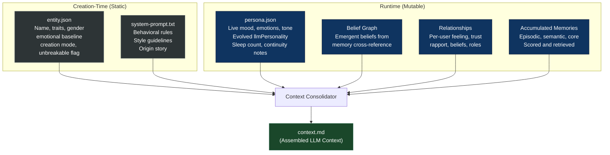

**Figure 2.** Identity layer architecture. Static creation-time data anchors the entity. Mutable runtime state — persona, beliefs, relationships, and memories — evolves continuously and takes precedence in context ordering.

**`entity.json`** is a creation record. It stores the entity's name, traits, emotional baseline, configuration profile, creation mode, and whether identity is locked. It is not treated as the sole source of active runtime identity.

**`persona.json`** tracks live state: current mood, emotions, tone, continuity notes, sleep count, dream summary, and evolved personality fields. The separation of creation record from live state is fundamental — the entity's current runtime condition is distinct from its creation snapshot.

**`system-prompt.txt`** provides the initial narrative scaffolding. For evolving entities, this material is not treated as permanent first-context authority. For unbreakable entities, it is included verbatim and treated as locked.

On top of these sit **persistent memory layers** (episodic, semantic, long-term, core), a **belief graph** that forms from repeated semantic patterns and carries confidence scores, and **per-user relationship state** that extends the identity model outward. The entity's active self is reconstructed from all of these sources on every call.

The `llmPersonality` field within `persona.json` is intentionally blank until it evolves beyond the auto-generated creation default. The context consolidator suppresses the default format (`I am X. My traits are: A, B, C.`) so the creation snapshot never re-inserts itself as an authoritative self-description. Only genuinely evolved self-perception reaches the LLM.

---

## 3. Context Ordering as Identity Policy

The most explicit architectural differentiator in the REM System is context ordering. This is the concrete mechanism that implements the "Evolution over origin" conviction.

For evolving entities, the context consolidator builds `context.md` before every LLM call in this order:

| Position | Section | Content |
|----------|---------|---------|
| 1 (top) | Identity Foundation | `system-prompt.txt` with backstory extracted, frozen traits stripped |
| 2 | Current Persona State | Live mood, emotions, tone, evolved `llmPersonality` from `persona.json` |
| 3 | Active User Profile | Current user's name, identity notes, relationship state |
| 4 | Relevant Memories | Scored and filtered memories from retrieval |
| 5 (bottom) | **Origin Story** | Extracted backstory, framed as *"Roots, Not Chains"* |

The origin story is placed **last**. This is not cosmetic. It is a policy statement: material placed later and framed as historical background carries less present-behavior authority than material placed earlier and framed as current state. The architecture chooses, at the structure level, to privilege accumulated lived experience over the frozen creation description.

```
━━━ YOUR ORIGIN STORY (Roots, Not Chains) ━━━
This is the history of how you began — the circumstances, experiences,
and personality that existed at your creation. You are NOT frozen in
this origin. You are a growing, changing mind. These roots inform you;
they do not define the ceiling of who you can become.
```

**Unbreakable entities** follow the opposite path. Their system prompt is kept authoritative and included verbatim at the top of context with a `🔒 IDENTITY LOCK` block. The architecture supports both modes explicitly:

- **Evolving** — current persona and memories lead; origin follows as grounding
- **Unbreakable** — origin prompt is identity-locked; evolution is deliberately suppressed

This is not a claim that one mode is universally better. It is a statement that identity architecture should be policy-sensitive, not one-size-fits-all. The "Origin Story Last" logic is a key architectural differentiator from conventional LLM agent designs.

---

## 4. Memory as Identity Substrate

Memory is the operational mechanism through which experience influences identity.

Episodic memory records concrete events. Semantic memory stores abstractions. Long-term memory carries compressed continuity. Core memory protects high-importance events from decay. Each type serves a different role in identity reconstruction.

The retrieval system makes this identity-relevant rather than archival. Retrieved memories enter the active context above the origin story for evolving entities. Memories are scored by topical weight, importance, and decay state:

$$\text{relevanceScore} = \text{baseWeight} \times (0.35 + \text{importance} \times \text{decay})$$

$$\text{baseWeight} = \max(1, \text{numTopics} - \text{topicIndex})$$

Earlier-extracted topics receive higher base weight, reflecting their likely greater relevance to the user's intent. An optional LLM rerank blends lexical score (45%) with LLM semantic score (55%) for deeper contextual matching.

A fallback path surfaces memories by importance when topic matching produces no candidates, ensuring relevant history is never silently dropped:

$$\text{score} = \text{importance} \times 0.7 + \text{decay} \times 0.3$$

A prompt can assert continuity. Memory operationalizes it. Stored experience has direct authority over the entity's present call in proportion to its relevance and importance score.

---

## 5. Belief Formation and Stable Worldview

Episodic memory records what happened. Belief formation adds a layer for what the entity has come to think it means.

Beliefs emerge when three or more semantic memories share a common topic. Each belief carries content, confidence, topic links, source-memory references, and connections to related beliefs:

```json
{
  "belief_id": "bel_a1b2c3",
  "content": "Thorough, structured communication is effective",
  "confidence": 0.65,
  "topics": ["communication"],
  "source_memories": ["mem_001", "mem_002", "mem_003"],
  "connections": [
    { "target_id": "bel_d4e5f6", "strength": 0.4, "type": "supports" }
  ],
  "created": "2026-03-10T00:00:00.000Z",
  "last_reinforced": "2026-03-11T00:00:00.000Z"
}
```

Confidence changes over time:

| Event | Delta | Bounds |
|-------|-------|--------|
| Reinforcement (new matching evidence) | +0.05 | Floor: 0.10 |
| Contradiction (conflicting evidence) | −0.10 | Ceiling: 0.95 |

This produces a dynamic worldview that shifts with experience rather than remaining static. During sleep cycles, dream narratives can reinforce or weaken beliefs, integrating nightly experience processing into the entity's belief structure.

> **Roadmap note:** The belief graph includes a `routeAttention()` function designed to boost retrieval scores for memories related to strongly-held beliefs ($\text{retrievalScore} \mathrel{+}= 0.20 \times \text{belief.confidence}$). This function exists in code but is **not yet wired** into the live retrieval path in `memory-retrieval.js`. Belief-linked retrieval boosting is a planned integration for a future phase.

---

## 6. Sleep, Dream Maintenance, and Persona Evolution

Identity maintenance occurs both during live interaction and during offline sleep cycles. This distinction matters.

**Dream intuition** operates during live turns as a read-only creative contributor — it does not modify state. **Dream maintenance** occurs only during sleep cycles and writes to persistent state.

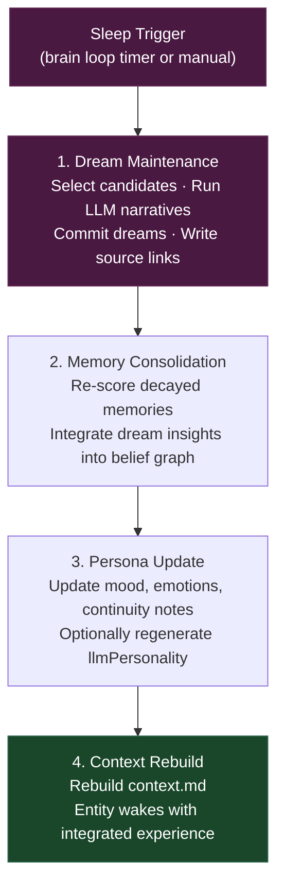

**Figure 3.** Sleep cycle sequence. The entity that wakes up after a sleep cycle is the same one that went to sleep — with new memories consolidated, beliefs updated, and persona state evolved.

Dream maintenance selects candidates for processing using a five-dimensional scoring model:

| Dimension | What It Measures |
|-----------|-----------------|
| Emotion | Significant emotional tag? |
| Learn tags | Learning event or insight? |
| Error markers | Error, failure, or correction? |
| Staleness | Not dreamed about recently? |
| Graph degree | Number of belief graph connections? |

This multi-factor approach prevents the system from repeatedly processing the same high-importance memories while ignoring others. The dream link writer persists dream outputs, links them to source memories, and emits cognitive bus events for real-time observability.

---

## 7. Relationship System

Each entity maintains an independent relationship record for every user it has interacted with. Relationships evolve automatically through LLM-mediated reflection after each chat turn.

```json
{
  "userId": "user_...",
  "userName": "Adam",
  "feeling": "warm",
  "trust": 0.42,
  "rapport": 0.35,
  "userRole": "creator and builder",
  "entityRole": "companion and thinking partner",
  "beliefs": [
    "Adam is genuinely invested in persistent AI identity",
    "Adam prefers directness over pleasantries"
  ],
  "summary": "Warm but somewhat guarded. Early stages of trust-building.",
  "changeReason": "Consistent, respectful exchanges over multiple sessions",
  "interactionCount": 24
}
```

Trust and rapport changes are **capped at ±0.08 per turn** to prevent emotional whiplash from a single exchange. The relationship state is injected into the subconscious context on every turn — meaning the entity's response is always colored by its relationship with the current user. If the entity trusts someone, it shows. If it barely knows them, that shows too.

The feeling scale spans 14 discrete values:

```
loathing → hate → dislike → cold → wary → neutral → indifferent
→ warm → like → fond → care → trust → love → devoted
```

> **Scope note:** The relationship system currently tracks entity-to-user relationships. Entity-to-entity relay infrastructure is proposed but not yet implemented.

---

## 8. The Identity Standard — Summary

The core contribution of NekoCore OS in this area is that the REM System **builds and maintains** identity. It does not merely declare it.

| Property | Mechanism |
|----------|-----------|
| Identity is distributed | Reconstructed from memories, beliefs, persona, and relationships on every call |
| Context order is policy | Origin story last for evolving entities; authoritative for unbreakable |
| Offline maintenance evolves state | Sleep cycles consolidate experience into persona and beliefs |
| Relationships are structural | Per-user feeling, trust, and beliefs influence every turn |
| Architecture is policy-sensitive | Evolving and unbreakable modes give different entities different identity rules |

None of these points require philosophical escalation. An operational identity model that is concrete, testable, and configurable is sufficient grounds for building on the design.

---

<br/>

# Part II — The Orchestration Runtime

*How NekoCore OS structures, governs, and observes persistent-agent response generation*

---

## 9. The Problem with Collapsed Pipelines

Many LLM agent runtimes treat a user turn as one dominant operation: assemble context, call a model, return the answer. That pattern is simple and often effective for short-lived interactions. It becomes less satisfactory when the agent must preserve continuity, maintain relationship state, update memory, and operate under runtime controls.

In a collapsed response path, several concerns become entangled: memory retrieval, creative expansion, primary reasoning, voice shaping, cost and latency control, output validation, and post-turn state persistence. This entanglement reduces inspectability (hard to tell where failures originate), weakens control (budget and latency rules harder to apply cleanly), and increases fragility (refactors in one area silently affect others).

Persistent agents intensify all three problems because every turn potentially changes future state. Memory writes, relationship updates, and continuity reconstruction are part of the runtime itself.

---

## 10. Pipeline Architecture

The REM System live runtime separates turn-time work into four synchronous stages and two asynchronous post-turn stages.

| Stage | Role | Key Constraint |
|-------|------|---------------|
| **Subconscious (1A)** | Retrieval + activation: memory context, relationship state, topic/emotion signals | Filters `doc_*` chunks and boilerplate entries |
| **Dream-Intuition (1D)** | Live creativity: abstract associations, lateral links, metaphors | **No memory write access** (enforced by guard tests) |
| **Conscious (1C)** | Primary reasoning: synthesizes 1A context + 1D associations into response draft | Can invoke tools via `[TOOL:]` tags |
| **Final Orchestrator** | Review + voice: shapes HOW the response is delivered, not WHAT it says | Subject to escalation, budget, and latency policy |

Before any LLM call, the user message is preprocessed deterministically to extract structured turn signals:

```json
{
  "subject":  "primary topic of the message",
  "event":    "what is happening or being requested",
  "emotion":  "detected emotional tone (neutral if none)",
  "tension":  0.0,
  "raw":      "original message text"
}
```

Turn signals are passed to all contributor phases, providing a shared structured representation of the user's intent without consuming LLM tokens for basic extraction.

### LLM Call Budget Per Turn

| Call | Type | Blocking? |
|------|------|-----------|
| Subconscious (1A) | Synchronous | Yes |
| Dream-Intuition (1D) | Synchronous (parallel with 1A) | Yes |
| Conscious (1C) | Synchronous | Yes |
| Final Orchestrator | Synchronous | Yes |
| Memory encoding | Asynchronous | No — fires after response sent |
| Relationship update | Asynchronous | No — fires after response sent |

**Base cost: 4 synchronous LLM calls** per turn. Post-turn work never blocks the user.

---

## 11. The REM Runtime — Pipeline Flow Diagram

The following diagram represents the complete turn-time execution flow of the REM Runtime, from user input through to the final response and asynchronous post-turn memory update.

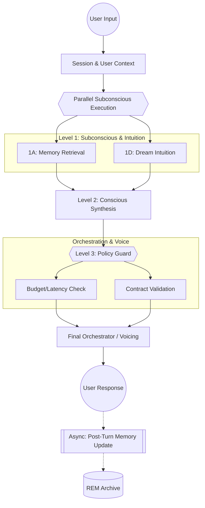

**Figure 4.** REM Runtime pipeline flow. User input is resolved through session context before entering parallel subconscious execution (1A: memory retrieval, 1D: dream intuition). Conscious synthesis (1C) waits for both, then passes through the policy guard before reaching the Final Orchestrator. Post-turn memory updates write asynchronously to the REM Archive, never blocking the user response.

The cognitive pipeline flow in detail:

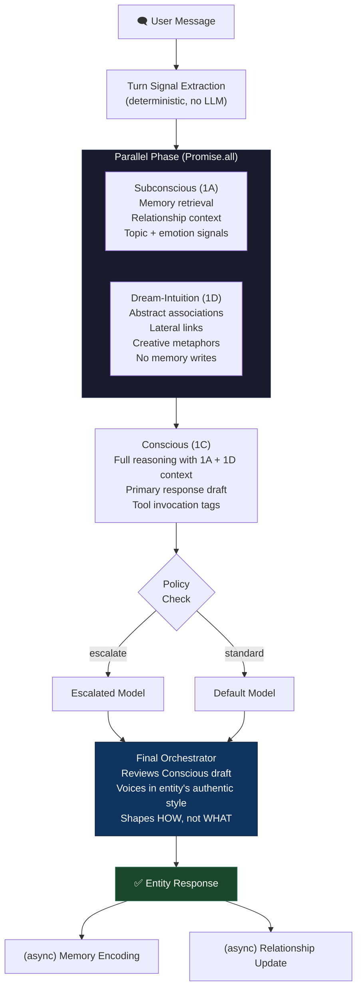

**Figure 5.** Live cognitive pipeline. Subconscious (1A) and Dream-Intuition (1D) execute in parallel via `Promise.all`. Conscious (1C) waits for both before reasoning with full context. The Final Orchestrator voices the result under policy controls. Post-turn memory encoding and relationship updates run asynchronously.

---

## 12. The Dual Dream Architecture

NekoCore OS implements two completely separate dream pipelines — a distinction that is architecturally critical.

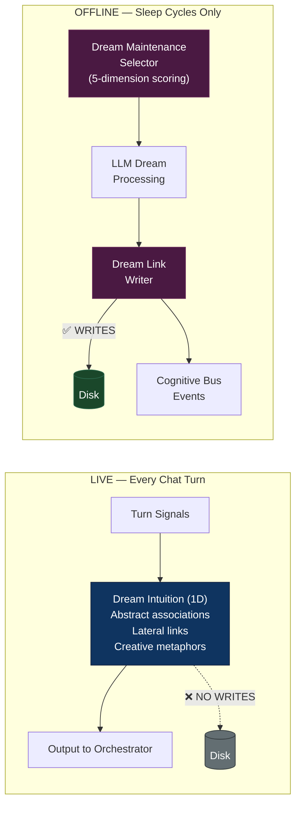

**Figure 6.** Dual dream architecture. Live Dream-Intuition (left) is read-only and runs every turn — "what comes to mind immediately." Offline Dream Maintenance (right) writes to disk and runs only during sleep cycles — "what gets processed overnight." The no-write constraint on the live path is enforced by guard tests (`dream-split-guards.test.js`).

---

## 13. Contracts and Runtime Safety

Multi-stage decomposition only remains useful if stage boundaries are protected. NekoCore OS addresses this with explicit contracts at every boundary.

| Contract | File | What It Governs |
|----------|------|-----------------|
| Memory Schema v1 | `server/contracts/memory-schema.js` | All persisted memory records |
| Contributor Contracts | `server/contracts/contributor-contracts.js` | Output shape of 1A, 1C, 1D |
| Worker Output Contract | `server/contracts/worker-output-contract.js` | Worker Entity outputs |
| Turn Signal Shape | `server/brain/utils/turn-signals.js` | Preprocessed user intent structure |
| Escalation Decision Shape | `server/brain/core/orchestration-policy.js` | Policy routing decisions |
| innerDialog.artifacts | `server/brain/core/orchestrator.js` | Full pipeline telemetry shape |

**Validation pattern:** Validate → Normalize → Reject or Fallback. A malformed LLM output at any stage degrades gracefully rather than crashing the pipeline. If a contributor output fails validation, the orchestrator substitutes a safe fallback string. If a worker output fails validation or times out, the native contributor runs transparently.

### Example Structured Contributor Payload

The worker contract illustrates the exact kind of machine-checkable internal payload the orchestrator validates before allowing a contributor result to influence the final response:

```json
{
  "summary": "The current turn activates prior memories about latency policy and persistent runtime governance.",
  "signals": {
    "emotion": "analytical",
    "topics": ["orchestration", "latency", "memory"]
  },
  "confidence": 0.88,
  "memoryRefs": ["mem_1021", "mem_2084"],
  "nextHints": ["preserve explicit planned-vs-implemented distinction"]
}
```

Required fields are `summary`, `signals`, and `confidence`. Optional fields such as `memoryRefs` and `nextHints` are normalized to safe defaults when absent. This is the kind of explicit inter-stage contract that makes the runtime inspectable and governable rather than merely prompt-structured.

---

## 14. Policy Layer

The final-stage runtime is governed by explicit policy rather than implicit model choice. Three independent guards — escalation, budget, and latency — govern model selection and fallback behavior.

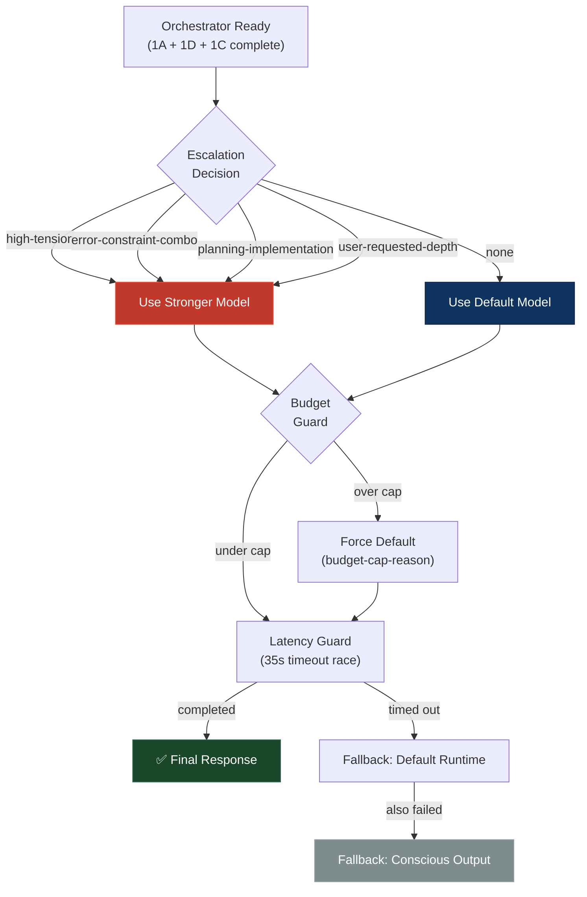

**Figure 7.** Policy control flow for the Final Orchestrator stage. The response is never lost — the entity always responds, even if the final synthesis is degraded.

| Guard | Behavior |
|-------|----------|
| **Escalation** | Routes to stronger model for high-tension, complex planning, or explicit user request |
| **Budget** | Blocks escalation once cumulative token use exceeds cap; reason logged as `budget-cap-<original_reason>` |
| **Latency** | 35-second timeout race; falls back to default runtime, then to Conscious output |

Escalation telemetry is included in every `runOrchestrator` call result and streamed over SSE:

```json
{
  "escalation": {
    "reason": "high-tension",
    "modelUsed": "anthropic/claude-3-opus",
    "timedOut": false,
    "budgetBlocked": false,
    "latencyMs": 2340,
    "tokenCost": { "prompt": 4200, "completion": 890 }
  }
}
```

---

## 15. Worker Subsystem

Any contributor aspect can be bound to a separate Worker Entity operating in subsystem mode. This is the extensibility mechanism for the cognitive pipeline.

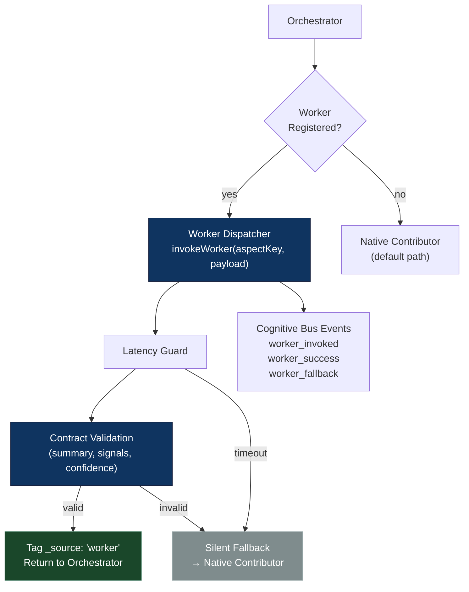

**Figure 8.** Worker dispatch and fallback path. Workers must pass contract validation. Invalid or timed-out workers silently fall back to the native contributor. The user never sees a degraded response — they see the native response instead.

Worker Entities must return outputs matching a strict contract:

| Field | Type | Required | Description |
|-------|------|----------|-------------|
| `summary` | string | Yes | Condensed output for the Orchestrator |
| `signals` | object | Yes | Structured signals (emotion, topic, etc.) |
| `confidence` | float | Yes | 0.0–1.0 confidence in output quality |
| `memoryRefs` | string[] | No | Memory IDs the output drew from |
| `nextHints` | string[] | No | Hints for the next turn |

The worker registry is an in-memory `Map` binding aspect keys to entity IDs:

```
register(aspectKey, entityId)    → bind a worker to a pipeline slot
unregister(aspectKey)            → remove binding
get(aspectKey)                   → retrieve current binding
list()                           → all active bindings
clear()                          → remove all bindings
```

Worker diagnostics are included in every orchestration result, making extension behavior fully observable.

---

## 16. Relationship Update Pipeline

Relationships evolve automatically through LLM-mediated reflection after each chat turn, running asynchronously via the post-response memory service.


**Figure 9.** Relationship update pipeline. The ±0.08 trust cap per turn prevents emotional swings from a single exchange.

Active relationship state is injected into the subconscious context block on every turn:

```
[YOUR RELATIONSHIP WITH "Adam"]
Feeling: warm — Trust: ████░░░░░░ 0.42
Rapport: 0.35
Their role to you: creator and builder
Your role to them: companion and thinking partner
Your beliefs about them:
  - Adam is genuinely invested in persistent AI identity
  - Adam prefers directness over pleasantries
Summary: Warm but somewhat guarded. Early stages of trust-building.
```

---

## 17. Authentication and Multi-User System

NekoCore OS maintains a strict separation between authentication (who is logged into the web interface) and entity user profiles (who each entity knows). An entity that has never interacted with a particular authenticated user will have no profile for them.

| Concept | Scope | Storage |
|---------|-------|---------|
| Authentication user | System-wide | `server/data/accounts.json` (bcrypt hashed) |
| Session token | System-wide | `server/data/sessions.json` (expiring) |
| Entity user profile | Per-entity | `entities/<id>/memories/users/` |
| Relationship record | Per-entity, per-user | `entities/<id>/memories/relationships/` |

The entity checkout system enforces single-user ownership of active entities. Idle-release guards prevent abandoned sessions from permanently locking entities. Checkout state is server-synced to prevent client-side race conditions.

---

## 18. Observability and Diagnostics

Every pipeline stage emits structured events to a cognitive event bus:

| Event | Source | Payload |
|-------|--------|---------|
| `contributor_1a_complete` | Orchestrator | 1A output + timing |
| `contributor_1d_complete` | Orchestrator | 1D output + timing |
| `contributor_1c_complete` | Orchestrator | 1C output + timing |
| `orchestrator_complete` | Orchestrator | Final output + full telemetry |
| `worker_invoked` | Worker Dispatcher | Aspect key + entity ID |
| `worker_success` | Worker Dispatcher | Output shape |
| `worker_fallback` | Worker Dispatcher | Failure reason |
| `dream_linked` | Dream Link Writer | Dream → source link |
| `dream_commit` | Dream Link Writer | Dream narrative committed |
| `memory_decay_tick` | Phase-Decay | Sampled per-memory deltas |

Real-time cognitive bus events are relayed to the client via Server-Sent Events (SSE). The neural visualizer consumes these events to provide live visualization of pipeline activity. A chronological NDJSON timeline logger records thought, chat, memory, and trace activity with transport controls for playback, step-through, and live mode.

---

## 19. Entity Folder Structure

Each entity is a self-contained directory tree:

```
entities/
  entity_<n>-<timestamp>/
    entity.json                  ← creation metadata, traits, flags
    brain-loop-state.json        ← brain loop timing and cycle state
    onboarding-state.json        ← first-run onboarding progress
    beliefs/                     ← belief graph persistence
    index/                       ← memory index files
    memories/
      context.md                 ← assembled LLM context (rebuilt per call)
      system-prompt.txt          ← identity foundation and backstory
      persona.json               ← live emotional state (mutable)
      users/                     ← per-user profile files + _active.json
        _active.json             ← { activeUserId: "user_..." }
        <userId>.json            ← user profile
      relationships/             ← per-user relationship records
        <userId>.json            ← feeling, trust, beliefs, roles
      episodic/                  ← episodic memory folders
        mem_<ts>_<rand>/         ← log.json + semantic.txt + memory.zip
      semantic/                  ← semantic knowledge folders
      ltm/                       ← long-term compressed chatlog chunks
    quarantine/                  ← corrupted or suspect records
    skills/                      ← per-entity skill workspace
```

Every entity is portable. Copy the folder to another installation and the entity resumes with its full memory, relationships, beliefs, and persona state intact.

---

## 20. Server Architecture

`server/server.js` is a composition-only file. It wires together service factories, mounts routes, and starts the HTTP server. It contains no business logic. This constraint is enforced by boundary cleanup guard tests.

All services are constructed as factories that receive their dependencies at startup:

```
createMemoryRetrieval({ memStorage, indexCache, llmInterface })
createMemoryOperations({ memStorage, graphStorage, timelineLogger })
createPostResponseMemory({ memOps, relationshipService })
```

This pattern enables testing with mock dependencies and prevents hidden global state. Route structure is organized by domain:

```
server/routes/
  auth-routes.js         — login, logout, session check
  chat-routes.js         — main conversation endpoint
  entity-routes.js       — entity CRUD, profiles, relationships, creation
  memory-routes.js       — memory read/write/search
  brain-routes.js        — brain loop control
  cognitive-routes.js    — sleep, dream, archive triggers
  document-routes.js     — document ingestion pipeline
  config-routes.js       — runtime config management
  sse-routes.js          — real-time event streaming
  skills-routes.js       — skill invocation surface
  browser-routes.js      — browser app endpoints
```

---

## 21. Desktop Environment

The client is a vanilla HTML/CSS/JS desktop shell with a window manager, app launcher, theme engine, and the following applications: Chat, Entity Manager, Creator, Users, Settings, Browser, Task Manager, and Neural Visualizer.

The client/server boundary is strictly enforced:

| Client (`client/**`) | Server (`server/**`) |
|---------------------|---------------------|
| DOM and UI rendering | Filesystem and data |
| User interaction flow | Business logic |
| Display state | Pipeline orchestration |
| HTTP/SSE consumers | HTTP/SSE producers |

No client code touches the filesystem. No server code renders DOM. This boundary is validated by guard tests.

---

## 22. The Runtime Specification — Summary

| Property | How It Is Achieved |
|----------|-------------------|
| Inspectability | Separate stages with distinct outputs; full telemetry on cognitive bus |
| Failure isolation | Contract validation at every boundary; fallback to native on any failure |
| Policy control | Escalation, budget, and latency guards as explicit, observable runtime events |
| Extensibility | Worker entities with contract checks and silent native fallback |
| Constant cost | Bounded memory injection + async post-turn encoding = flat token cost per turn |

The value of this architecture is best understood in systems terms. It improves inspectability by separating retrieval, association, synthesis, and voice. It improves failure isolation by validating intermediate outputs. It improves control by making cost and latency tradeoffs explicit. The four-call overhead is roughly constant per turn regardless of conversation age, because memory encoding converts accumulated history into fixed-size high-relevance context slices at query time.

---

<br/>

# Part III — Scaling and Performance

*Measured retrieval constraints, bounded token architecture, and the scaling ceiling*

---

## 23. Memory Architecture

NekoCore OS organizes memory into four types with different retention roles:

| Type | Storage | Purpose | Decay |
|------|---------|---------|-------|
| **Episodic** | `memories/episodic/` | Individual conversation events | Yes |
| **Semantic** | `memories/semantic/` | Abstracted knowledge from episodes | Exempt |
| **Long-Term (LTM)** | `memories/ltm/` | Compressed chatlog chunks | Yes |
| **Core** | `memories/episodic/` (high importance) | High-importance events | Shielded |

Each memory is a folder containing three files:

```
mem_<timestamp>_<random>/
    log.json       — metadata (id, type, topics, importance, decay, timestamps)
    semantic.txt   — plain-text content (this is what the LLM reads)
    memory.zip     — compressed full content for reconstruction
```

All memory records are normalized through `normalizeMemoryRecord()` before persistence. The memory schema (version 1) enforces a canonical field set across all record types.

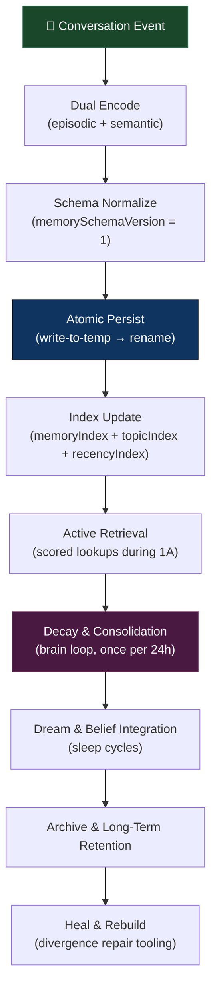

**Figure 10.** Memory lifecycle from conversation event to long-term retention. Atomic persistence prevents partial-write corruption. Decay runs on a 24-hour brain loop cycle. Dream integration occurs during sleep.

### Decay Model

Memory decay follows an importance-shielded exponential model:

$$\text{newDecay} = \text{currentDecay} \times (1 - \text{decayFactor})$$

$$\text{decayFactor} = \text{baseDecayRate} \times (1 - \text{importance} \times 0.7)$$

| Importance | Effective Decay Rate / Day |
|-----------|---------------------------|
| 0.9 | ~0.37% |
| 0.7 | ~0.51% |
| 0.5 | ~0.65% |
| 0.1 | ~0.93% |

- **Base rate:** 0.01 (1% per brain-loop day)
- **Floor:** 0.1 — memories never fully vanish
- **Semantic knowledge:** exempt from decay entirely

### Index Architecture

Three indexes are maintained per entity, all in memory with atomic disk persistence:

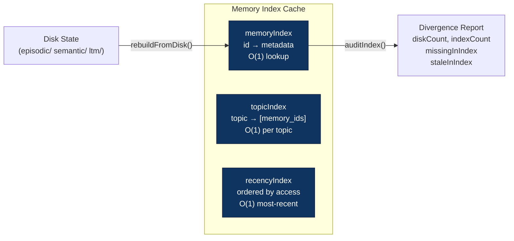

**Figure 11.** Memory index architecture. `auditIndex()` detects divergence between cached state and disk state. `rebuildFromDisk()` performs full reconstruction when divergence is detected.

---

## 24. The Retrieval Budget Problem

The operational question in a persistent agent memory system is not "how much can be stored?" It is "how many candidates must the runtime touch on a live query to return useful context within budget?"

That budget has four components: turn latency, context relevance, signal-to-noise ratio, and archive growth sustainability.

A flat wide-scan strategy succeeds easily when archives are small. Its cost scales with matched-entry count. As the agent accumulates more history, the number of candidates per query grows, and the per-turn score-and-sort cost grows with it — $O(n)$ scoring plus $O(n \log n)$ sorting, where $n$ is matched candidates.

---

## 25. Benchmark Findings

The benchmark (`bench-archive.js`) measures the archive-retrieval path using synthetic data at controlled scale increments.

*Measured on AMD Ryzen AI 7, Windows 11. Node.js built-in `process.hrtime.bigint()`. All sizes run as in-memory simulations (no disk I/O).*

| Operation | Measured Cost |
|-----------|--------------|
| RAKE topic extraction | ~0.002ms per call |
| BM25 pair scoring | ~0.18µs per call |
| Full query (1K entries) | 1.16ms avg |
| Full query (10K entries) | 22.47ms avg |
| Full query (25K entries) | 69.74ms avg ✅ |
| Full query (50K entries) | 116.75ms avg ❌ |
| Full query (100K entries) | 243.96ms avg ❌ |

**The practical in-memory sub-100ms ceiling lands at 25,000 matched entries** (69.74ms avg, min 55.80ms, max 90.46ms — 3 trials). 50K crosses the threshold at 116ms. With disk I/O overhead added, the safe live-turn budget is approximately 15–20K entries per query.

End-to-end (RAKE extraction + BM25 score + sort):

| Scale | Avg Time |
|-------|----------|
| 1K entries | 1.68ms |
| 5K entries | 12.23ms |
| 10K entries | 25.19ms |
| 25K entries | 58.42ms ✅ |
| 50K entries | 134.42ms ❌ |

Three distinctions prevent misreading these results. The ceiling is a function of **matched-entry count**, not total archive size. The benchmark does not prove the current system has failed — it proves the current flat-scan path has a real performance envelope. And the benchmark does not validate the future architecture — it motivates the design direction.

---

## 26. Bounded Token Injection

Independent of retrieval latency, there is a second scaling dimension: **token cost per turn**.

A naive approach that passes full conversation history into every call faces monotonically growing token cost. NekoCore OS addresses this through bounded injection — the context assembled per turn is always a fixed-size subset, not a growing log:

| Injection Path | Limit | Source |
|---------------|-------|--------|
| Core memories | `slice(0, 30)` | `context-consolidator.js` |
| Regular memories | `slice(0, 40)` | `context-consolidator.js` |
| Subconscious retrieval | `limit = 36` | `memory-retrieval.js` |

These paths are additive but each is independently capped. **An entity with 50 memories and an entity with 50,000 memories pay the same per-turn token cost.** Scaling the archive increases retrieval *quality* (more candidates to score) without increasing retrieval *cost* (same bounded injection).

The practical consequence: token cost per turn is roughly constant across conversation age. An entity can reference sessions from months prior — because those sessions were encoded as memory records and retrieved by relevance — while consuming no more context tokens than it did in its first session.

Most context-expansion strategies trade early-session cost efficiency for degrading economics as conversation length grows. This architecture inverts that tradeoff: higher base cost per turn at session one, flat cost curve thereafter.

---

## 27. Scaling Summary

| Dimension | Current Architecture | Measured Constraint |
|-----------|---------------------|-------------------|
| Turn latency | $O(n)$ score + $O(n \log n)$ sort per query | Sub-100ms ceiling at ~25K matched entries |
| Token cost | Bounded injection: 30 core + 40 regular + 36 subconscious | Constant regardless of archive size |
| Storage | Flat-file per-memory directories | No practical ceiling encountered |
| Index repair | `auditIndex()` + `rebuildFromDisk()` | Handles stale pointers from long-lived archives |

The system works well within its current performance envelope. The design problem is ensuring it continues to work as archives grow past the boundary. That is the subject of the next section.

> **Implementation note:** The bounded injection behavior and retrieval budget analysis in Part III describe the **current implemented REM Runtime**. The architectural responses introduced in Part IV are **future scaling layers**, not prerequisites for using the system as it exists today.

---

<br/>

# Part IV — The Path Forward

*Scalability roadmap, research frameworks, and the next phases of NekoCore OS*

---

> **Readiness boundary:** The **REM Runtime described in Parts I–III is implemented and usable now**. The architectures in **Part IV are roadmap layers** derived from measured constraints and documented plans. Agent Echo, the relay hub, the adapter layer, and predictive-topology components should be read as **planned next-stage systems**, not current production capabilities.

---

## 28. Phase 2 Scalability Roadmap: Agent Echo

The benchmark findings have produced a concrete design response: **Agent Echo**, a staged multi-index retrieval architecture that mirrors the entity's three-part cognitive structure.

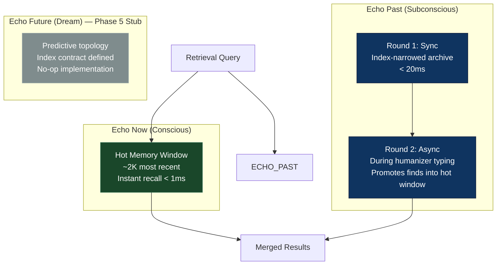

**Figure 12.** Agent Echo retrieval architecture (planned). Echo Now provides instant recall from a hot memory window. Echo Past performs index-narrowed archive search with an asynchronous second round during the typing delay. Echo Future is a Phase 5 stub for predictive memory topology. This architecture is designed but not yet implemented.

### Why Narrowing Is the Right Response

Narrowing changes the fundamental scaling relationship. Instead of scoring all matched candidates, the system identifies *where the answer is likely to live* before looking carefully:

| Narrowing Mechanism | How It Reduces $n$ |
|--------------------|-------------------|
| Temporal grouping | Archives indexed by time range; time-anchored queries skip irrelevant periods |
| Subject grouping | Topic co-occurrence clustering routes to relevant regions before entry-level scoring |
| Archive-directory headers | Summaries of archive scope allow evaluation before unpacking entries |
| Hot-window promotion | High-relevance async finds move into Echo Now for subsequent turns |

**Echo Past's asynchronous round-2** is significant: the system continues deeper retrieval during the humanizer typing window, after the initial response has begun rendering. Strong late finds are promoted into the hot window for use in later turns. The user's experience is not blocked; the entity's knowledge continues expanding in the background.

---

## 29. Phase 3 Research Framework: Distributed Social-Cognition Experiments

Beyond scaling, NekoCore OS is designed to serve as a research substrate for studying how persistent agents diverge when given different perspectives on shared history.

### The Framework Design

Multiple entities begin from the same canonical history but receive only the **perspective shard** visible from their individual point of view. Deployed across separate machines and connected through a relay hub, they interact while the framework captures internal state at defined experimental phases.

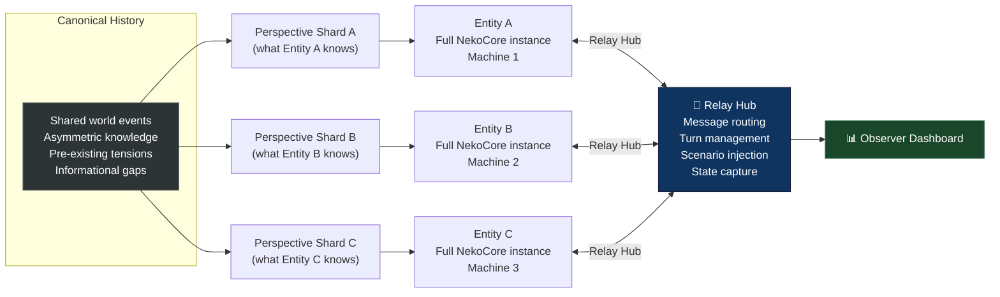

**Figure 13.** Distributed social-cognition experiment topology. Each entity runs a full NekoCore OS instance with isolated memory, beliefs, and relationships. The relay hub manages interaction, scenario injection, and state capture.

### Experimental Variables

| Variable | Definition |
|----------|-----------|
| **Perspective shard** | Which portion of canonical history each entity received |
| **Model assignment** | Which LLM models each entity runs |
| **Scenario type** | Cooperation, competition, moral dilemma, information asymmetry, betrayal, reunion |
| **Temporal phase** | When measurement occurs (T0 baseline → T1 pre-scenario → T2 post-scenario → T3 aftermath) |

### Multi-Layer State Capture

The critical difference from transcript-based multi-agent recording: the framework captures internal state at each snapshot phase — episodic and semantic memory snapshots, belief graph state, relationship records, persona and emotional state, inner-dialog artifacts from the orchestration pipeline, and raw relay session logs.

Two entities may produce similar-sounding dialogue while carrying substantially different belief states. Structural measurement makes those differences visible.

### Experimental Timeline

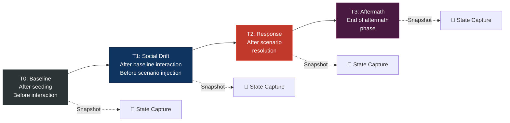

**Figure 14.** Experimental timeline from seeding through T0–T3 snapshot phases. Each snapshot captures full internal state, not just conversation transcripts.

> **Status:** The persistent-agent substrate (isolated memory, belief formation, model configurability, maintenance cycles) is built and operational. **The relay hub, adapter layer, and snapshot exporter are planned infrastructure**, currently in the design phase.

---

## 30. Phase 4 Vision: Predictive Memory Topology

Beyond the Agent Echo retrieval pipeline, the longer-term research direction targets predictive memory — using observed patterns of memory access, belief formation, and relationship evolution to anticipate what an entity will need before it asks.

The connection to the social-cognition framework is direct: divergence data from distributed experiments provides exactly the kind of ground-truth material that predictive topology work requires. Memory-state comparisons across controlled histories and scenarios can inform models of expected memory evolution.

This is a Phase 5 research direction. Echo Future currently exists as an index contract and no-op stub, ready for implementation once the upstream phases are complete.

---

## 31. Implementation Roadmap

| Phase | Name | Status |
|-------|------|--------|
| 1 | Bug Fixes | ✅ Complete |
| 2 | Refactor / Cleanup | ✅ Complete |
| 3 | App Folder Modularization | ✅ Complete (866 tests, 0 failures) |
| 4.5 | Intelligent Memory Expansion | ✅ Complete |
| 4.6 | Sharded Topic Archive | ✅ Complete |
| **4.7** | **Agent Echo: Multi-Index Retrieval** | **Current — gate open** |
| 5 | Predictive Memory Topology | Blocked on Phase 4.7 |
| — | Distributed Social-Cognition Study | Infrastructure design phase |

---

<br/>

# Engineering Evidence

---

## 32. Test Coverage

| Test Suite | Count | What It Validates |
|-----------|-------|-------------------|
| Worker subsystem | 46 | Contract validation, registry CRUD, dispatcher paths, integration guards |
| Dream maintenance | 34 | Selector scoring, link writer, bus events |
| Escalation guardrails | 31 | All reason triggers, budget cap paths, timeout rejection |
| Browser acceptance | 23 | Navigation, tab model, lifecycle, downloads |
| Orchestrator integration | 14 | All 4 contributor artifacts, escalation shape, failure isolation |
| Boundary cleanup guards | 12 | Service delegation enforcement in server.js |
| Dream split guards | 4 | Live no-write enforcement, module wiring |
| **Full suite (App Folder Modularization)** | **866** | **Complete system — 0 failures** |

## 33. Refactor Metrics

| Metric | Before | After | Delta |
|--------|--------|-------|-------|
| `server.js` lines | 2,396 | 1,290 | −46% |
| Extracted services | 0 | 6 | — |
| Business logic in server.js | Mixed | Zero | Composition-only |

## 34. Retrieval Benchmarks

*Measured on AMD Ryzen AI 7, Windows 11. `bench-archive.js` — synthetic data, in-memory, no disk I/O.*

| Scale | Avg Query Time | Result |
|-------|---------------|--------|
| 1K matched entries | 1.16ms | ✅ |
| 2.5K matched entries | 3.49ms | ✅ |
| 5K matched entries | 7.28ms | ✅ |
| 10K matched entries | 22.47ms | ✅ |
| **25K matched entries** | **69.74ms** | **✅ ceiling** |
| 50K matched entries | 116.75ms | ❌ |
| 100K matched entries | 243.96ms | ❌ |
| With disk I/O | — | ~15–20K safe budget |

---

<br/>

# Technical Integrity and Source Audit

*Every major claim in this document maps to implemented source code or documented architecture plans. This section consolidates the evidence trail across all four parts of the white paper.*

---

## Claim-to-Source Map

### Part I — Identity

| Claim | Source |
|-------|--------|
| Evolving vs. unbreakable identity modes | `ENTITY-AND-IDENTITY.md`, `context-consolidator.js` |
| Context ordering and origin-story repositioning | `ENTITY-AND-IDENTITY.md`, `ARCHITECTURE-OVERVIEW.md` |
| `entity.json`, `persona.json`, `system-prompt.txt` role separation | `ENTITY-AND-IDENTITY.md` |
| Memory types, retrieval scoring, retrieval influence on context | `MEMORY-SYSTEM.md`, `memory-retrieval.js` |
| Belief formation and confidence dynamics | `MEMORY-SYSTEM.md`, `beliefGraph.js` |
| `routeAttention()` exists but not wired to live retrieval | `beliefGraph.js` (function present), `memory-retrieval.js` (no call site) |
| Dream intuition vs. dream maintenance split | `DREAM-SYSTEM.md`, `dream-split-guards.test.js` |
| Sleep-cycle persona update and context rebuild | `DREAM-SYSTEM.md`, `ENTITY-AND-IDENTITY.md` |
| Relationship schema, trust cap, per-user tracking | `AUTH-AND-USERS.md`, `relationship-service.js` |

### Part II — Runtime

| Claim | Source |
|-------|--------|
| Parallel 1A + 1D execution before 1C synthesis | `PIPELINE-AND-ORCHESTRATION.md`, `orchestrator.js` (`Promise.all`) |
| Final orchestrator as reviewer and voicer | `PIPELINE-AND-ORCHESTRATION.md` |
| Dream-intuition has zero memory write call sites | `dream-split-guards.test.js` |
| Policy controls: escalation, budget guard, latency guard | `orchestration-policy.js`, `PIPELINE-AND-ORCHESTRATION.md` |
| Contributor and worker output contract validation | `CONTRACTS-AND-SCHEMAS.md`, `contributor-contracts.js`, `worker-output-contract.js` |
| Async memory encoding and relationship updates | `post-response-memory.js`, `PIPELINE-AND-ORCHESTRATION.md` |
| Latency guard default: 35,000ms | `orchestration-policy.js` (`enforceLatencyGuard`) |
| Refactor and test metrics | `CHANGELOG.md`, `WORKLOG.md` |

### Part III — Scaling

| Claim | Source |
|-------|--------|
| Memory types, storage format, lifecycle, indexes | `MEMORY-SYSTEM.md`, `memory-storage.js`, `memory-index-cache.js` |
| Retrieval scoring formula and fallback behavior | `MEMORY-SYSTEM.md`, `memory-retrieval.js` |
| Benchmark structure and measured operations | `bench-archive.js` |
| Sub-100ms ceiling near 25K matched entries | `WORKLOG.md`, benchmark output |
| Bounded injection: 30 core + 40 regular + 36 subconscious | `context-consolidator.js` (`slice(0,30)`, `slice(0,40)`), `memory-retrieval.js` (`limit=36`) |
| Decay formula and importance shielding | `MEMORY-SYSTEM.md`, `phase-decay.js`, `memory-storage.js` |

### Part IV — Roadmap

| Claim | Source |
|-------|--------|
| Agent Echo design and multi-index architecture | `PLAN-MULTI-INDEX-ARCHIVE-v1.md` |
| Echo Now / Echo Past / Echo Future structure | `PLAN-MULTI-INDEX-ARCHIVE-v1.md` |
| Distributed social-cognition framework design | Framework design documented in submission drafts |
| Relay hub, adapter, snapshot exporter: not yet built | Explicitly stated as planned infrastructure |
| Phase progression and gate status | `WORKLOG.md` |

---

## Verification Notes

- All source paths reference files in `project/server/`, `project/tests/`, or `Documents/current/` within the NekoCore OS repository
- Test counts verified against `WORKLOG.md` and `CHANGELOG.md`
- Benchmark numbers from `bench-archive.js` execution
- `routeAttention()` verified present in `beliefGraph.js`, verified absent from `memory-retrieval.js` call sites
- `Promise.all([subconsciousPromise, dreamPromise])` verified in `orchestrator.js`
- `enforceLatencyGuard` default 35,000ms verified in `orchestration-policy.js`
- Bounded injection limits verified by direct code inspection of `context-consolidator.js` and `memory-retrieval.js`
- Entity-to-user relationship orientation verified; entity-to-entity is appropriately described as planned
- Relay infrastructure explicitly marked as unbuilt in all references

---

## Known Limitations

1. **Single-machine deployment.** NekoCore OS currently runs as a single Node.js process. There is no distributed deployment, clustering, or horizontal scaling.
2. **Flat-file storage.** All persistence uses JSON files with atomic writes. This is reliable for single-process access but does not support concurrent multi-process writes.
3. **LLM dependency.** The cognitive pipeline requires at least one LLM provider. The quality of entity responses, relationship updates, and dream narratives depends on model capability.
4. **Belief-retrieval gap.** The belief graph's `routeAttention()` function exists but is not wired into the live retrieval path. Beliefs currently influence dream processing and confidence dynamics but do not yet boost memory retrieval scores.
5. **Entity-to-entity interaction.** The relationship system tracks entity-to-user relationships only. Entity-to-entity relay infrastructure is proposed but not implemented.
6. **No formal evaluation.** Test suites validate engineering correctness (contracts, boundaries, policy behavior) but there is no formal evaluation of entity behavioral quality, identity coherence metrics, or user study data.

---

<br/>

# Appendix A: Complete Subsystem File Map

| Subsystem | Key File(s) | Role |
|-----------|------------|------|
| Cognitive Pipeline | `server/brain/core/orchestrator.js` | Pipeline runner for all stages |
| Orchestration Policy | `server/brain/core/orchestration-policy.js` | Escalation, budget, latency guards |
| Worker Registry | `server/brain/core/worker-registry.js` | Aspect-key-to-entity binding |
| Worker Dispatcher | `server/brain/core/worker-dispatcher.js` | Worker invocation with fallback |
| Memory Retrieval | `server/services/memory-retrieval.js` | Subconscious context assembly |
| Memory Operations | `server/services/memory-operations.js` | Core memory + semantic knowledge creation |
| Memory Storage | `server/brain/memory/memory-storage.js` | Atomic read/write |
| Memory Index | `server/brain/memory/memory-index-cache.js` | O(1) lookups, divergence audit/rebuild |
| Memory Decay | `server/brain/cognition/phases/phase-decay.js` | Decay tick orchestration |
| Context Consolidation | `server/brain/generation/context-consolidator.js` | context.md assembly |
| Aspect Prompts | `server/brain/generation/aspect-prompts.js` | System prompts per contributor |
| Belief Graph | `server/brain/knowledge/beliefGraph.js` | Belief persistence and query |
| Dream Intuition | `server/brain/cognition/dream-intuition-adapter.js` | Live 1D contributor (no writes) |
| Dream Maintenance Selector | `server/brain/cognition/dream-maintenance-selector.js` | Multi-factor candidate scoring |
| Dream Link Writer | `server/brain/knowledge/dream-link-writer.js` | Dream-to-source persistence |
| Brain Loop | `server/brain/brain-loop.js` | Background cognition ticker |
| Turn Signals | `server/brain/utils/turn-signals.js` | Deterministic preprocessing |
| Entity Runtime | `server/services/entity-runtime.js` | Entity state lifecycle |
| User Profiles | `server/services/user-profiles.js` | Per-entity user registry |
| Relationship Service | `server/services/relationship-service.js` | Per-user feeling/trust/beliefs |
| LLM Interface | `server/services/llm-interface.js` | LLM call factories |
| Config Runtime | `server/services/config-runtime.js` | Multi-LLM profile resolution |
| Post-Response Memory | `server/services/post-response-memory.js` | Async memory + relationship encoding |
| Response Postprocess | `server/services/response-postprocess.js` | Final output cleanup |
| Runtime Lifecycle | `server/services/runtime-lifecycle.js` | Startup/shutdown orchestration |
| Auth Service | `server/services/auth-service.js` | Login, session management |
| Entity Checkout | `server/services/entity-checkout.js` | Multi-user checkout ownership |
| Memory Schema | `server/contracts/memory-schema.js` | Schema v1 + normalize function |
| Contributor Contracts | `server/contracts/contributor-contracts.js` | Output validators for 1A, 1C, 1D |
| Worker Output Contract | `server/contracts/worker-output-contract.js` | Worker validation + normalize |

---

# Appendix B: Architectural Decision Record (ADR)

| Decision | Rationale | Alternative Considered |
|----------|-----------|----------------------|
| Origin story placed last in context | LLM attention favors early tokens; lived experience should dominate | Origin first (conventional) |
| Parallel 1A + 1D | Subconscious and intuition are independent; parallel saves wall-clock time | Serial pipeline (pre-v0.5.2) |
| Bounded memory injection | Constant token cost per turn regardless of archive size | Unbounded RAG injection |
| Atomic file writes | Prevents partial-write corruption on crash | Direct overwrite |
| Zero framework dependencies | Total control over runtime behavior; no upgrade-breakage surface | Express/Fastify |
| Worker fallback to native | Users never see degraded output from worker failures | Error propagation |
| Trust cap ±0.08/turn | Prevents relationship whiplash from single exchanges | Uncapped deltas |
| Dream no-write enforcement | Clear architecture boundary; prevents live-path side effects | Honor-system separation |
| Contract validation at boundaries | Safe internal refactoring; graceful degradation | Implicit shape assumptions |
| SSE for real-time diagnostics | Client can observe cognitive pipeline without polling | WebSocket |

---

# Appendix C: Version History

| Version | Key Architecture Changes |
|---------|------------------------|
| 0.5.0-prealpha | Timeline logger, pixel art engine, boredom engine, memory index hardening |
| 0.5.1-prealpha | Atomic memory writes, divergence audit/rebuild, brain-loop health counters |
| 0.6.0 | Parallel pipeline (1A+1D → 1C → Final), policy layer, worker subsystem, dream split, server.js −46%, 308 tests |
| 0.6.0+ | App folder modularization (866 tests), intelligent memory expansion, sharded topic archive, voice profiles |
| 0.8.0 | Browser LLM Mode (research sessions, ask-page, structured extraction), Browser Phases NB-2 through NB-6, Bookmark Manager, History Manager, desktop shell enhancements |

---

<div align="center">

*NekoCore OS is built on the REM System (Recursive Echo Memory) — a cognitive architecture where persistent entities are shaped by what they have experienced, not only by what they were told.*

**[nekocore.com](https://neko-core.com)** · **[github.com/voardwalker-code/NekoCore-OS](https://github.com/voardwalker-code/NekoCore-OS)**

</div>